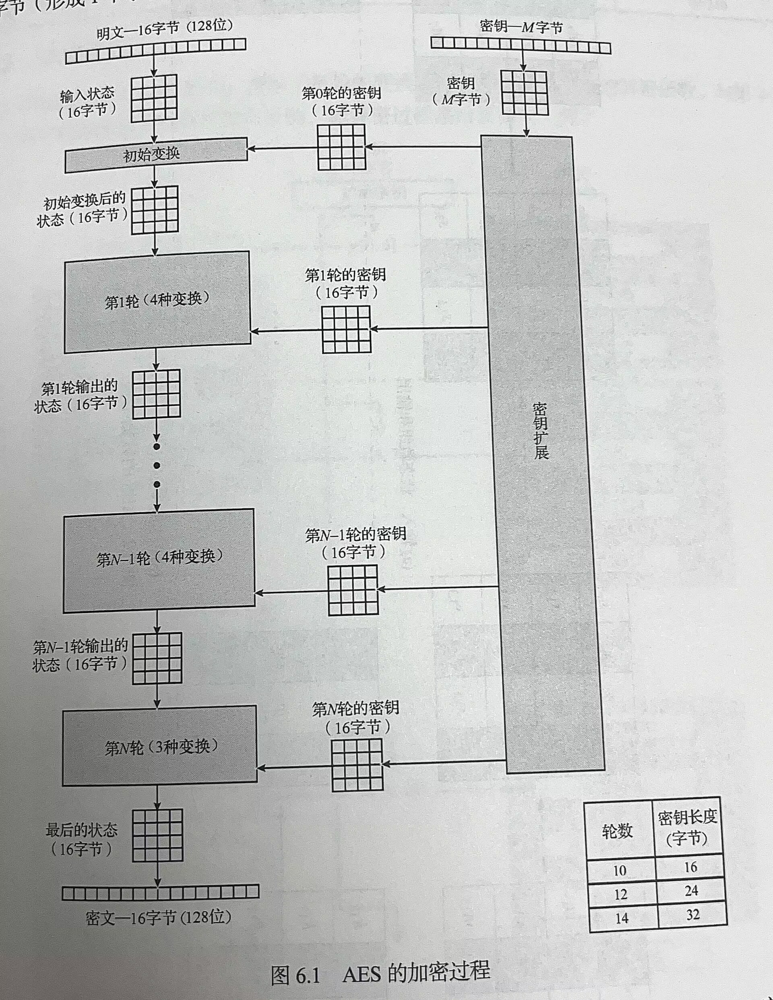
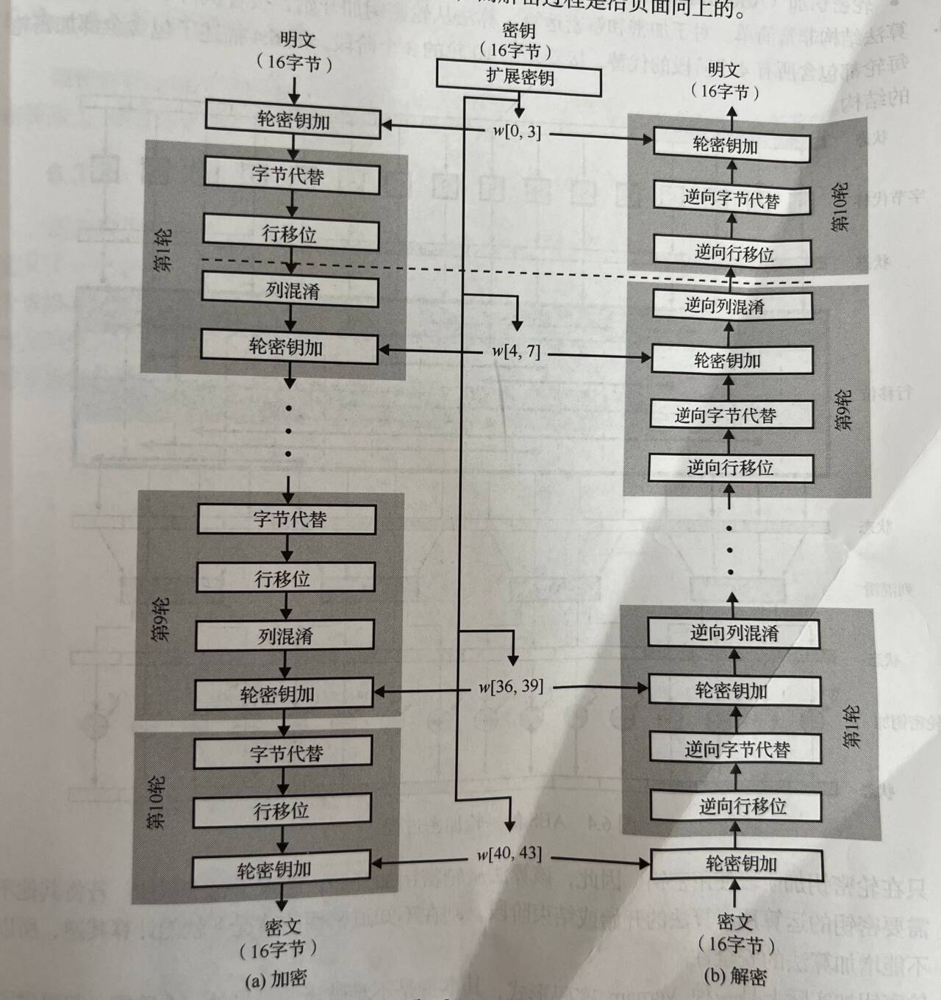
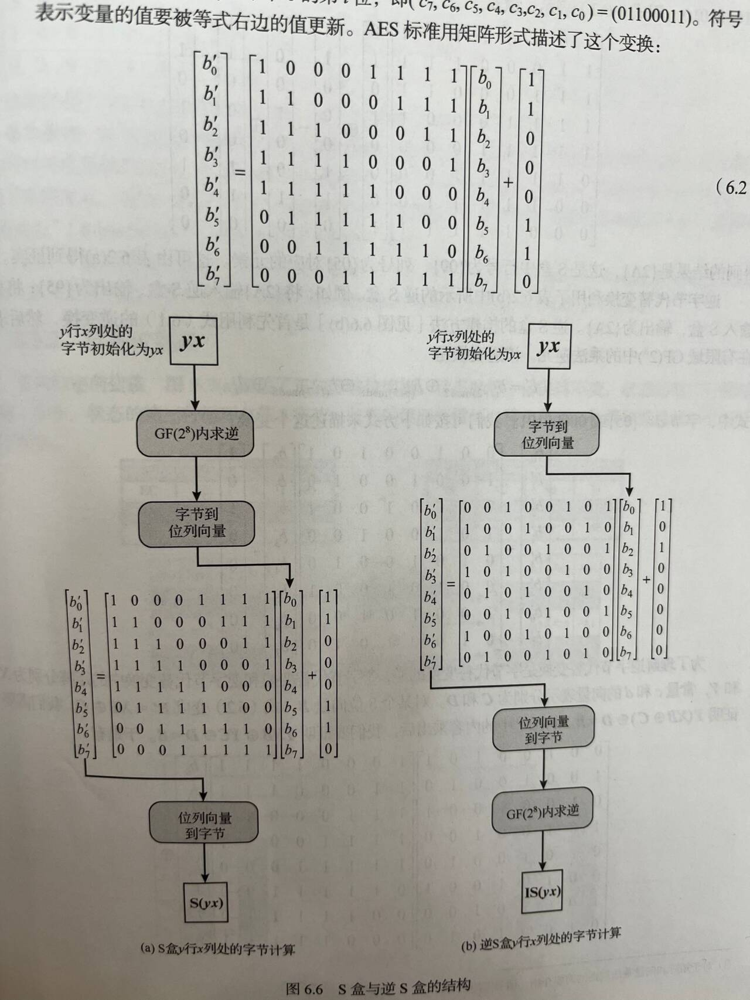
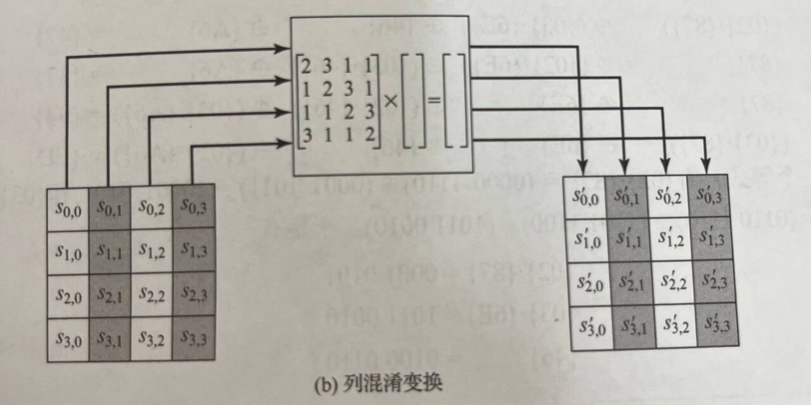
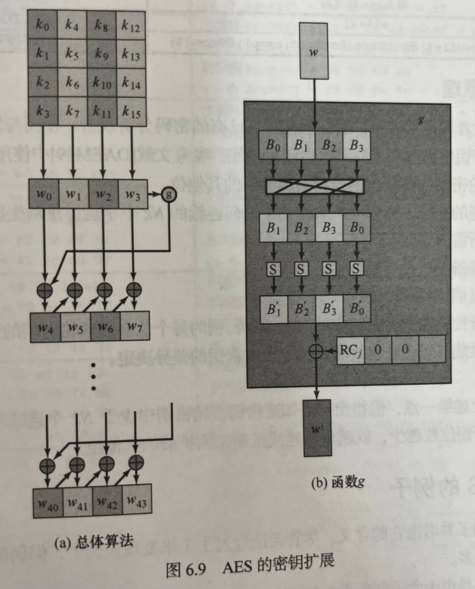
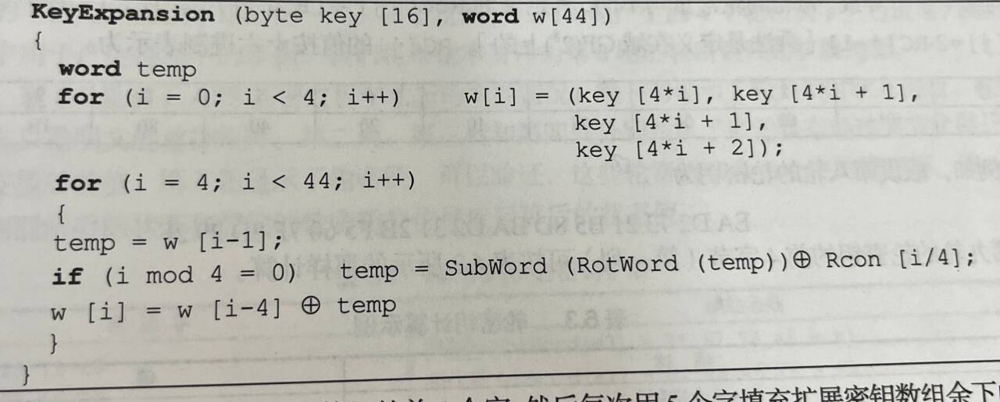

# AES
## 实验任务
## 实验要求
## 实验原理
AES被定义在多项式有限域$GF(2^8)$(Galois域)下(8位二进制数=1字节)。运算时系数以2为模。表示时不写$x$而只写系数，例如$01100110$等。选取的既约多项式为$x^8+x^4+x^3+x+1$，即$100011011$。
### AES基础设定
- SPN Structure：十轮(若是16字节子密钥)；
- 密钥长度128/192/256位(16/24/32字节)；
- 分组长度128bits(16字节)。
- 所有加减乘除运算都是在$GF(2^8)$上定义的。

### 密钥生成
- 选取一个16字节（128位）的4×4方阵作为主密钥。 
- 密钥拓展：输入一个4字(16字节)主密钥的4×4方阵，输出一个44字的矩阵:11×4，为初始变换和10轮提供子密钥。
### 算法解释

##### 前后期白化：轮密钥加
- 开始轮函数前和结束后，需要用一个子密钥先进行依次KeyAdd，引入随机性：前/后期白化，加入白噪声。
- 为什么要加入前后期的轮密钥加？**因为整个算法中用到密钥的只有每个轮函数的轮密钥加**，对于其他不需要密钥的运算来说可以轻松逆向得到上一步的结果，所以在头尾增加轮密钥加以增加安全性。
##### 轮函数
一个轮函数是可逆的，有四层。
###### 字节代换(S盒子SBox)
1. 唯一一个非线性的函数(**因为使用了乘法逆元**)。正/逆向变换通过查表实现。一个字节8位，高4位构成一个0-15的值作为S盒的行序号，第四位作为列序号，定位到S盒子的某个位置。
2. 如何计算出S盒子每个位置的值？
   1. 首先初始化S盒子表：按照字节升序，第一行是01、02、...、0F；第二行是11、12...、1F
   2. 接着计算x行y列位置的S盒子值：计算s[x][y]在$GF(2^8)$下的乘法逆元$s^-1[x][y]$，00映射为00。
   3. 对每个xy位置的字节计算一个变换：$b_i'=b_i \oplus b_{i+4 \ mod 8} \oplus b_{i+5 \ mod 8} \oplus b_{i+6 \ mod 8}\oplus b_{i+7 \ mod 8} \oplus c_i$,其中$c=01100011$
   4. 如图构造的原因：在$GF(2^8)$下，系数是模2运算的，**所以加法等同与异或，乘法等同于和**。这个矩阵相乘相当于是3中的变换。
3. 如何计算逆S盒子每个位置的值？
   1. 利用上面2.3中变换的逆变换(反过来异或)之后，再求乘法逆元即可。
   2. 事实上，正向S盒子X和逆向S盒子Y相互为逆矩阵，即$XY=I$(单位矩阵)。
4. 
###### 置换层:行移位
Shift Row置换层。
- 正过程：对于4×4矩阵，第一行不变，第二行左移1位，第三行2位，第四行3位。
- 逆过程：循环右移。
- 将一个字节从一列移动到另外一列之后用轮密钥加密。确保了一列中的4字节被拓展到四个不同得列。
###### 列混淆
列混淆变换Mix Col层。
- 所有加法和乘法都是在$GF(2^8)$域上的。
- 有一个列混淆矩阵U，一个逆矩阵W：WU=E（单位矩阵）；则原矩阵S混淆$S' = US$；逆变换$S = WS'$。不仅变换了位置(置换)，也进行了混淆。
- 正向变换：
- 逆向变换：
- 注意：最后一轮没有列混淆。正向变换使用小技巧可以很快得乘，因为最多乘3，而逆向变换比较麻烦：**CBC等模式只需要加密，消息验证码也只需要加密**。
###### 轮密钥加
密码加KeyAdd:将4×4的128位输入矩阵与4字轮密钥(4×4字节128位)直接异或。
##### 密钥生成
输入4个字（16字节）输出44个字（176字节）。

1. 首先将输入的16字节转换为4个字放入w[0..3]中
2. 接着对于每一个4字组的开头w[i](i mod 4 = 0)，选择w[i-1]经过复杂函数g处理后的值和w[i-4]异或得到结果，对于4字组的其他值w[i](i mod 4 != 0)，使用w[i-1]和w[i-4]直接异或得到结果。
3. g复杂函数：
   1. 首先进行字循环RotWord，循环左移一个字节。
   2. 接着字代替SubWord,利用S盒代替。
   3. 最后与轮常量Rcon[j]进行异或运算；
   - 轮常量：是一个字，其中最右边三字节为0，最左边的字节为RC[1] = 01,RC[2] = 2 * RC[1] = 02...
##### 