# 密码学
# 第一章
## 计算机安全的核心目标： 
- 保密性(Confidentially)
  - 数据保密性：**隐私信息不被非授权者查看或使用**
  - 隐私性：确保个人能**控制或确定**哪些信息可以被收集和保存、谁能公开、向谁公开
- 完整性(Integrity)
  - 数据完整性：信息和程序只能**以授权的方式进行改变**
  - 系统完整性：确保系统以正常方式运行，**避免非授权操作**
- 可用性(Availability)：确保系统迅速反应，且**对授权用户不能拒绝服务**
以上统称为CIA原则
- 更多：
  - 真实性：要能够确保**可被验证和可被信任**，即能确保用户是他声明的那个用户、系统的输入都是来自可靠信源。
  - 可追溯性：每个实体的行为必须可**唯一追溯**到该实体。要能够追查到安全泄露的那一方。
## 缺失定义
- 保密性缺失：信息的非授权**泄露**
- 完整性缺失：信息的非授权**修改和毁坏**
- 可用性缺失：对信息与信息系统的**访问和使用的中断**
## 安全攻击
- 被动攻击：对传输进行**窃听和监测**
- 主动攻击：对数据流进行**改造或伪造**数据流
 - 伪装：伪装成另一个实体，例如截获有权限方的认证信息，完成认证后重放信息，即可获得额外权限。
 - 重放：将截获的信息再次发送
 - 消息修改：未经授权**修改合法消息**的某一部分、延迟消息传输、改变消息顺序。
 - 拒绝服务
## 安全服务
一种由系统提供的**对系统资源进行特殊保护**的处理或通信服务。安全服务通过安全机制来实现安全策略。
# 数论基础
## 整除性与带余除法
$b|a$:b整除a，b是a的因子；例如3|9、4|24
- 性质：
  - $a|1 -> a=\pm1$
  - $a|b且b|a -> a = \pm b$
  - $任何非0整数n|0$
  - $若b|g且b|h，则对于任意整数m、n，有b|(mg+nh)$
## 欧几里得算法
### 最大公因子gcd
gcd(a,b)，表示能同时整除a、b的最大整数，一定是正数。
- gcd(0,0) = 0
- gcd(a,b) = 1，则a、b互素
- gcd(a,b) = gcd(|a|,|b|)
- gcd(a,0) = |a|
### 欧几里得算法计算
gcd： 设$a\geq b > 0$，求解$d = gcd(a,b)$。
  1. 计算a与b的余数r1，得到$a = q_1b + r_1$
  2. 若$r_1 \neq 0$，则用b替换a，$r_1$替换b，计算$b = q_2r_1 + r_2$
  3. 若$r_2=0$，则$r_1$为最大公因子d
  - 即计算$d = gcd(r_1,r_2)$，若余数$r_3$为0则余数为$r_2$，否则$d=gcd(r_2,r_3)$
  ```Python
  def gcd(a,b):
    #递归算法
    r = a % b
    if r == 0:
        return b
    else:
        return gcd(b,r)
  ```
### 拓展欧几里得
- 同时计算出一个gcd(a,b)，且计算出$x、y$，使得$ax+by=gcd(a,b)$。其中x、y有着相反的正负号。
- 计算过程：
  1. 使用欧几里得算法计算d=gcd(a,b)，但记录下所有r（余数）和q（带余除法的结果）。
  2. 设$x_{-1}=1,y_{-1}=0,x_0=0,y_0=1$
  3. 计算$x_i=x_{i-2}-q_ix_{i-1}，y_i=y_{i-2}-q_iy_{i-1}$，对于每个i，都满足$r_i=ax_i+by_i$
  4. 计算到$i=n时r_{n+1}=0$，可以得到gcd(a,b)为$r_{n}$,要求的$x=x_n,y=y_n$。
- 利用拓展欧几里得求逆元：在模n下a的逆元x，若$ax \equiv 1(\mod n)，则ax = bn + 1，则ax+bn=1。$则可以用于计算a、n互素时，a的逆元(**只有当a、n互素时才有逆元**)：直接计算extended_gcd(a,-n)，得到的x就是a的逆元。
- ```Python
  def extended_gcd(a,b):
      x = [1,0]
      y = [0,1]
      i = 2
      r = 1
      while r != 0:
          r = a % b
          q = a // b
          if r == 0:
              return b, x[len(x)-1], y[len(y)-1]
          a = b
          b = r
          x.append(x[i-2] - q * x[i-1])
          y.append(y[i-2] - q * y[i-1])
          i += 1
  ```
## 模运算mod
$a/n = q 余 r$，r即为$ a \mod n $
### 同余
- 若$a\mod n = b\mod n$，称为a、b模n同余。记为$a\equiv b(\mod n)$
- $a\equiv 0(\mod n)，则n|a$
- 性质:
  - 若$n|(a-b)，则a \equiv b (\mod n)$
  - 若ab模n同余、bc模n同余，则ac模n同余
  - $a \equiv b (\mod n)则b \equiv a (\mod n)$
  - 若$(a+b) \equiv (a+c) (\mod n)，则b \equiv c (\mod n)$
  - **当a与n互素时**，若$(a×b) \equiv (ac) (\mod n)，则b \equiv c (\mod n)$。原因：如果a与n互素，则$Z_n$中的所有数乘以a可以得到完整的$Z_n$，而如果不互素，则得不到完整剩余类集。
### mod运算性质
- $(a+b) \mod n = (a \mod n + b \mod n) \mod n$
- $(a-b) \mod n = (a \mod n - b \mod n) \mod n$
- $(a×b) \mod n = (a \mod n × b \mod n) \mod n$
### 模运算中定义：
- 负数（加法逆元）：a的负数b满足：$a+b = 0$。例如在模8运算中，3的负数是5。在加法运算表中，**所有0元素对应的行列互为加法逆元**。
- 倒数（乘法逆元）：a的乘法逆元满足：$a×b = 1$。例如在模8运算中，3的乘法逆元为3。在乘法运算表中，**所有1元素对应的行列互为乘法逆元**。#注：并非所有元素都有乘法逆元。
### 剩余类
n的剩余类（集）：$Z_n = \{0,1,2,...,n-1\}$，定义为小于n的所有非负整数。剩余类表示为$[0]、[1]、...、[n-1]$，其中$[r] = \{a:a为整数，且a \equiv r (\mod n)\}$，但一般直接用$r$表示剩余类。
## 素数
- 任何整数a>1，都可以分解为多个素数的乘积：$a=p_1^{a_1}×p_2^{a_2}...×p_n^{a_n}$
- $a=\prod p^{a_p}，b=\prod p^{b_p}$，其中$p$是某个整数，而$a_p$表示整数的指数，若$a|b$，则有$a_p \leq b_p$
- 若$k = gcd(a,b)，那么k_p=min\{a_p,b_p\}$
## 费马定理与欧拉定理
### 费马定理
- 若p是素数，且p不能整除a，则$a^{p-1} \mod p 余数永远为1$。即$a^{p-1} \equiv 1 (\mod p)$
- 若p是素数，a是**任意正整数**，则有$a^p \equiv a (\mod p)$
### 欧拉函数
- $\phi(n)表示小于n且与n互素的元素个数，\phi(1)=1,\phi(4)=count([1,3]=2)$
- 对于一个素数p，总存在$\phi(p)=p-1$
- 对于素数p、q，n=pq有$\phi(n)=\phi(pq)=\phi(p)\phi(q)=(p-1)(q-1)$
- 欧拉定理：
- 对于任意互素的$a、n$，存在$a^{\phi(n)} \equiv 1 (\mod n)$
- 对于任意互素的$a、n$，存在$a^{\phi(n)+1} \equiv a (\mod n)$
- 中国剩余定理：
- 求解一元线性同余方程组：对于一个物品有c个， 每组p1个数剩r1，每组p2个数剩r2...
### 中国剩余定理形式
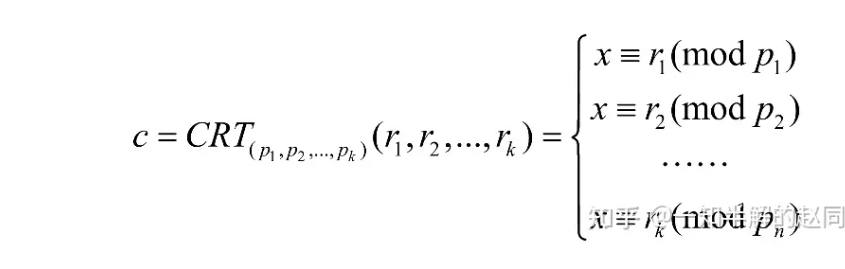
1. 将原问题分解为：$X=X_1+X_2+...+X_n$，其中$X_1 \mod p_1 = r1$，而$X_1 \mod p都为0$；$X_2 \mod p_2 = r_2$,$而X_2 \mod其他p均为0......$
2. $将X_i转换为Y_i，其中，Y_i \mod p_i = 1$，而mod任意其他均为0，则需要求解的数字$X=\sum Y_i×r_i$
3. 由于$Y_i \mod 任意其他p均为0$，则$Y_i = k_i * \prod_{k,k\neq i} r_i$。由于$Y_i \mod p_i = 1$，则有$k_i * \prod_{k,k\neq i} r_i \equiv 1 (\mod p_i)$，则就是求$Y_i在模p_i下的逆元$
    ```Python
    import euclid_gcd as g
    def china(rs,ps):
        #转换为求解逆元的过程
        X = 0
        for i in range(len(rs)):
            y_e = 1
            for j in range(len(rs)):
                if j != i:
                    y_e *= ps[j]
            _,k,_ = g.extended_gcd(y_e,ps[i])
            X += rs[i] * k * y_e
        return X 
    ```

## 素数判断
- Rabin-Miller算法
  - 随机选取一个a，一次遍历后通过测试的概率是$\frac{1}{4}$
    - 首先对于一个**奇整数n**，可以分解为n-1=$2^kq$，其中$q$是奇数。
    - 随机选取一个$a(1<a<n-1)$
    - 从$j=[1,k-1]$开始计算，若j=1时，$a^{2^jq}=a^{q} \mod n=1$，则返回**不确定**
    - 若$j \neq 1$，若存在$a^{2^jq} \mod n = n-1$，则返回不确定
    - 遍历完所有$j$后仍未返回不确定，则就是合数。
  - 选取多个不同的随机a进行测试，t次遍历后一个合数仍能通过测试的概率为$(\frac{1}{4})^t$
  
  ```python
  import random
  def rabin_miller(n,t):
    if n % 2 == 0:
        print(f"{n}是合数")
    #随机选取t个a
    aa = []
    while len(aa) < t:
        rint = random.randint(2,n-2)
        if aa.count(rint)==0:
            aa.append(rint)

    #将奇整数分解
    k = 1
    while int((n-1) / (2 ** k)) % 2 == 0:
        k += 1
    q = int((n - 1) / (2 ** k))

    #j = 0时，查看是否a^q mod n为1
    for a in aa:
        flag = False
        if (a ** q) % n == 1:
            flag = True
        if not flag:
            for j in range(0,k):
                if (a ** ((2 ** j) * q)) % n == n-1:
                    flag = True
                    break
        if not flag:
            print(f"{n}是合数")
            return
    print(f"在{t}次测试下，{n}均通过测试，可能是素数") 
  ```

# 群论基础
抽象代数中，考虑**元素进行代数运算的集合**
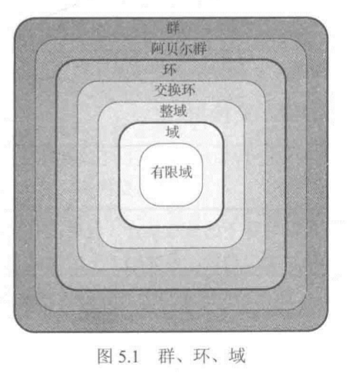
- 根据元素个数是否有限，分为有/无限群环域
- **阶数**：群/环/域内元素个数
## 群
群是一个**二元运算**的集合。记作$G\{G,·\}$。$G$是一个元素集合，$·$是一个运算。
- **群**有如下性质：  
  1. (加法)封闭性A1：若$a,b \in G$，则$a · b \in G$。即两元素运算后的结果仍然在群中。
  2. (加法)结合律A2：$a · (b · c) = (a · b) · c$
  3. (加法)单位元A3：存在一个单位元$e$，使得任意$a \in G$有$a · e = e · a = a$
  4. (加法)元A4：对于任意$a \in G$，存在一个$a' \in G$，使得$a · a' = e$
- **交换群**有如下性质：
  1. 是一个群A1-A4
  2. (加法)交换律A5：$a · b = b 成
- \*循环群有如下性质：
  - 定义幂运算$a^k = a · a ·...$;$a_0 = e$;$a_{-k}=a'^k$
  1. 是一个群，群中只由一个元素$a$以及$a^k$组成。一定是交换群。
## 环
环有两个二元运算，记作$R=\{R,+,×\}$。在环上进行加减乘不脱离集合。
- **环有**如下性质：
  1. $R$关于加法是一个交换群，即满足A1-A5
  2. 乘法封闭性M1
  3. 乘法结合律M2：$a × (b × c) = (a × b) × c$
  4. 乘法分配律M3：$a×(b+c)=a×b+a×c$
- **交换环**有如下性质：
  1. 是一个环：A1-A5，M1-M3
  2. 乘法交换律：M4
- **整环**有如下性质：
  1. 是一个交换环
  2. 乘法单位元M5**1**
  3. 无零因子M6：存在一个0，使得如果$a × b = 0$，则必有$a = 0或b = 0$
## 域
域有两个二元运算，记作$\{F,+,×\}$。在域中进行加减乘除而不脱离域。
- **域**满足：
  1. 是一个整环。A1-A5，M1-M6
  2. 乘法逆元
## 总结图
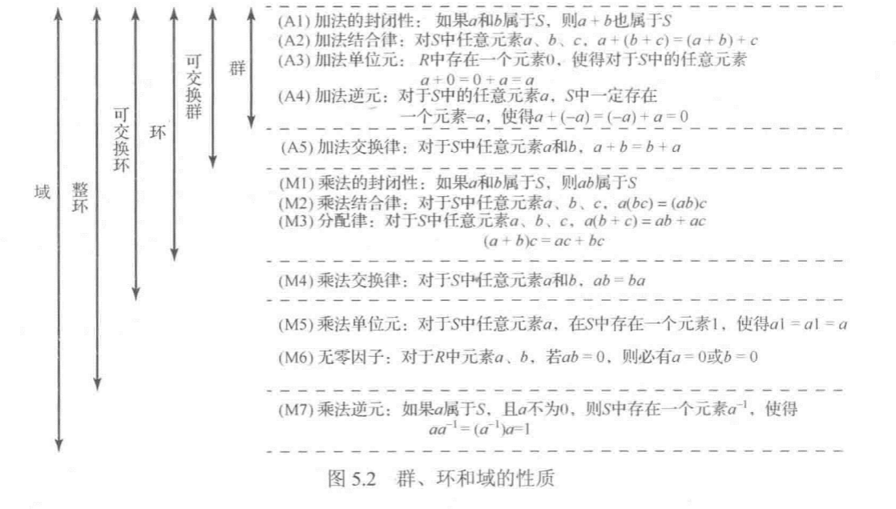
## 有限域GF(p)
- GF(p)定义为整数$\{0,1,2,3...,p-1\}$的集合$Z_p$，其中**p是一个素数**，加乘要模p。
- 最有意义的是GF(2)，在GF(2)中，加法等同异或，乘法等同逻辑与。
### 乘法逆元
- 对于$Z_p$中的任意一个整数a，其**有乘法逆元的条件是$a$与$p$互素**。当p是素数时，所有$Z_p$中的非零整数都与$p$互素，则每个非零元素都有乘法逆元（**在mod p 条件下**）。
- $Z_p$上求乘法逆元：
  1. p值小，则直接构造一个乘法表，取得数为1的行列。
  2. 拓展欧几里得算法：
    - 若$b$与$p$互素，即$gcd(b,p)=1$，则可知在$Z_p$上$b$一定有乘法逆元$b' < p$。
    1. 此时要计算$b$在$\mod p$下的乘法逆元，可以构造函数：$(px + by) \mod p = gcd(b,p) = 1$
    2. 得到$px \mod p + by \mod p = 0 + by \mod p = gcd(b,p) = 1$
    3. 使用扩展欧几里得算法，得到的$y$就是b的乘法逆元$b'$
### 多项式运算
$f(x) = \sum{i}^{n} a_ix^i$;其中$a_i$称为系数集S,$a_n \neq 0$。若$a_n = 1$，则称为**首一多项式**。
- 系数集S是环，则不一定有除法定义，可能导致不能整除；系数集S是**有限**域，也不一定整除。定义有限域S内的多项式除法如下：
  - 一个$n$次多项式$f(x)$，$m$次多项式$g(x)$，计算$frac{f(x)}{g(x)}$，商式为$q(x)$，余式$r(x)$，则得到一个带余数的式子$f(x) = q(x)g(x) + r(x)$。
  - 如果允许存在余数$r(x)$，则称有限域F内多项式除法是**可能的**。将余式记作$r(x) = f(x) \mod g(x)$；若$r(x) = 0$，则$g(x)$整除$f(x)$，记作$g(x)|f(x)$
- 如果系数域F中某个多项式$f(x)$**不能表示为任何F中其他多项式的乘积**，则称$f(x)$为素多项式。
- 多项式加减乘除：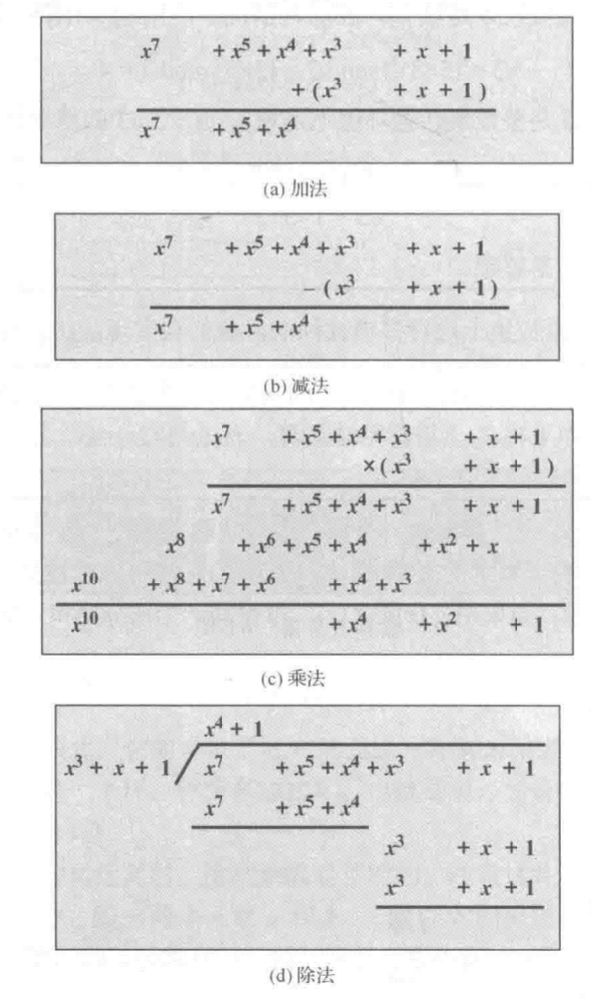
### 求最大公因式
类似普通的欧几里得算法，有$gcd(f(x),g(x))=gcd(g(x),f(x) \mod g(x))$并辗转相除
## 有限域$GF(2^n)$
### 为什么要引入$GF(2^n)$
- 原因：计算机中的n位字，希望可以构造一个域，元素范围在$0-2^{n}-1$。然而，普通的$GF(2^n)$，并不是一个域，因为$2^n$不是一个素数。则额外在系数为$GF(2)$的n项的多项式上定义一个$GF(2^n)$,有如下性质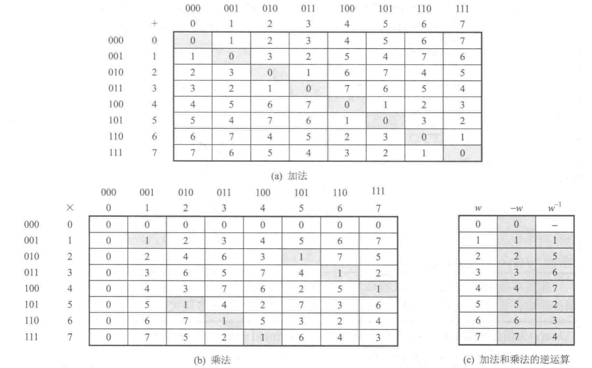。
- 优势：是一个域，每一个元素在加减上都有逆元。且在加减乘除运算中，每个元素出现次数是均匀的，适合密码算法。
### **多项式的模运算**
- $GF(p^n)$，是所有由系数是$Z_p$，且有n项的多项式组成的集合（如$p=2,n=3$，则有8个项）。要满足域条件，需要满足：
  1. 加与乘满足普通多项式运算规律。
  2. 系数运算以p为模，即系数在$Z_p$中。
  3. 乘法运算结果的最大次数$\leq n-1$，若超过则要使用一个n次(n+1项)不可约多项式$g(x)$(某个素多项式)取模。即$f'(x) = r(x) = f(x) \mod g(x)$
- 在不可约多项式的模下，可以使用扩展欧几里得算法计算某个多项式的乘法逆元：
  1. 对于一个不可约n次多项式$g(x)$，一定有$f(x) \in GF(2^n)$，使得$gcd(f(x),g(x))=1$
  2. 则有$f(x)×\phi_1(x) \mod g(x) + g(x)×\phi_2(x) \mod g(x) = 1$，即$f(x)×\phi_1(x) \mod g(x) = 1$，计算的$\phi_1(x)$就是$f(x)$的乘法逆元。
# 分组密码
通常用16进制表示
## Feistel密码体制
- DES、CAST、BlowFish密码等
- 轮询密码。将输入分为两组进行加密。这个过程类似异或，是可逆的。**将输出两组互换作为输入重新计算一次就会变回来**。
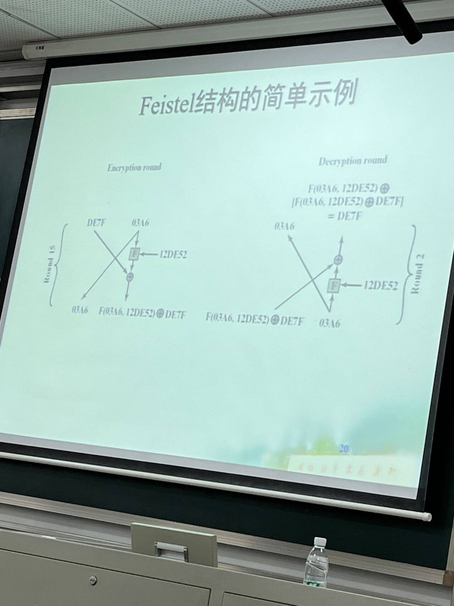
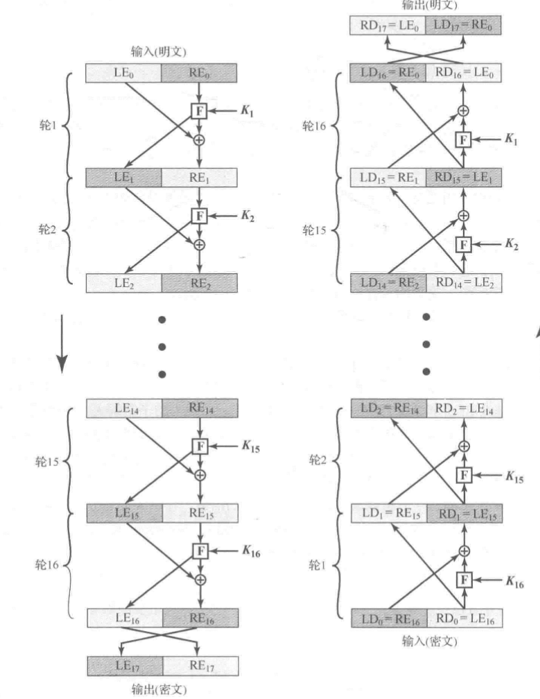
- 特点：计算快捷方便。不要求轮函数可逆，基于伪随机。有多轮；每轮有异或等可恢复操作；有**轮函数**。
- 轮函数设计原则：
    1. 非线性越多越难进行差分分析
    2. 有效性分析：
        1. SAC严格雪崩准则：要求S盒输入任何一位发生变化，输出只要一半变化。
        2. 没看清QWQ
## DES算法(Feistel体制)
分组长度：64比特；密钥长度：56比特（密钥加长难以穷举）；轮数：16（轮数增加难以密码规律分析）
### DES流程：
#### 总体结构
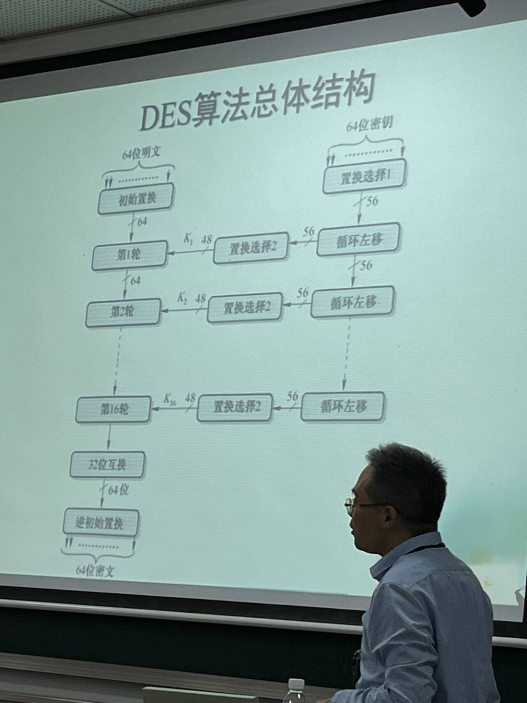
#### DES初始化操作
1. 将文本转变为二进制数形式。分为64位的多个组Group；如果某个组不足64位，则需要补0padding。
2. 将每个组放入IP初始置换中进行置换。IP类似洗牌，固定可逆，有一张IP置换表，表中数字i表示用第i个index的值替换。[IP](image-2.png)
#### DES轮加密操作
1. 每一轮会将64位组分为$L_iR_i$左右32位两部分。
2. 首先，将$R_i$进行拓展置换为48位；
 通过原56bit的密钥生成一个48位的子密钥$K_i$。计算48位的$R_i \oplus K_i$。
  - R的扩展：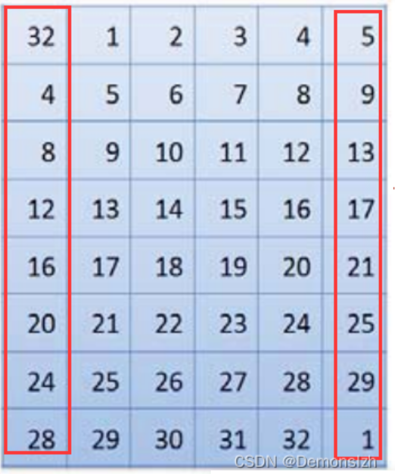
  - 密钥调度算法(Key Schedule Algorithm)：将64位主密钥(其中8位是奇偶校验位，不起加密作用)分为16个48位子密钥。
      - 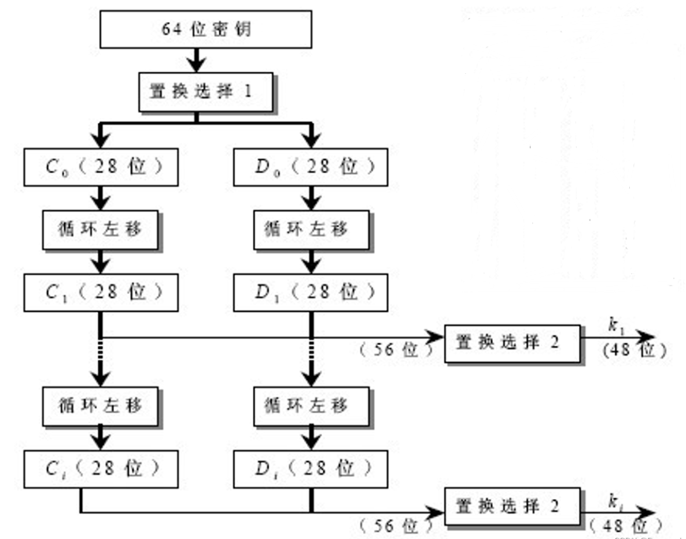
      - 置换1(PC1)：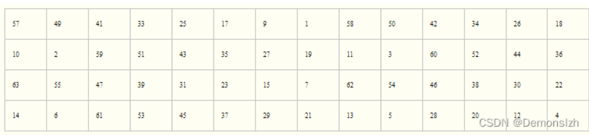。丢弃每8位的最后一位，即奇偶校验位。
      - 置换2(PC2)：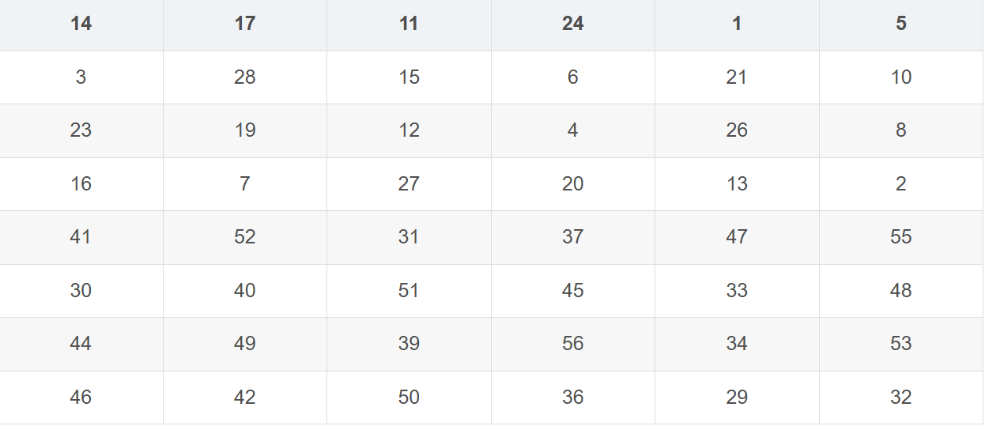
1. 将$R_i \oplus K_i$放入**非线性S盒**中，将48位映射到32位，是一个压缩函数。    
  - S盒：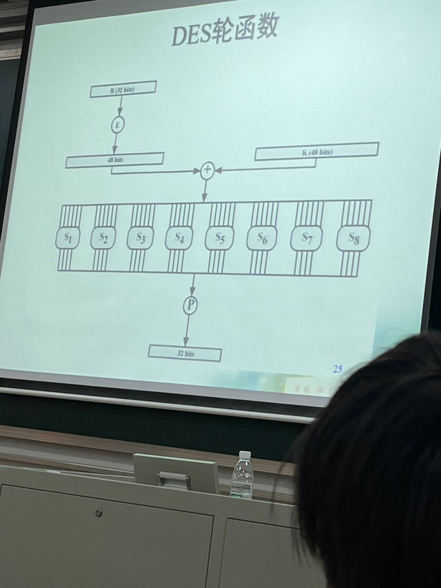
  - S1盒 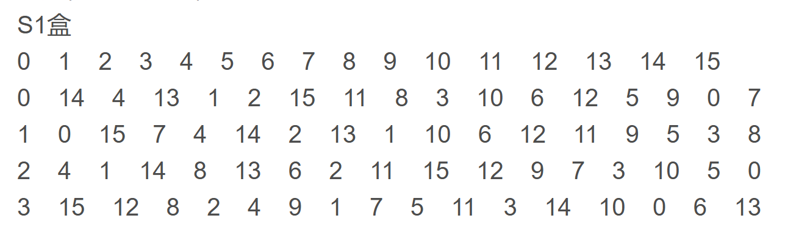
2. 再将S盒输出的32位放入P盒中置换，得到轮密钥RoundKey。将$RK$与$L_i$异或后得到下一组的$R_{i+1}$。将原$R_i$直接放到$L_{i+1}$即完成一轮加密。
- 末置换FP：是IP的逆过程。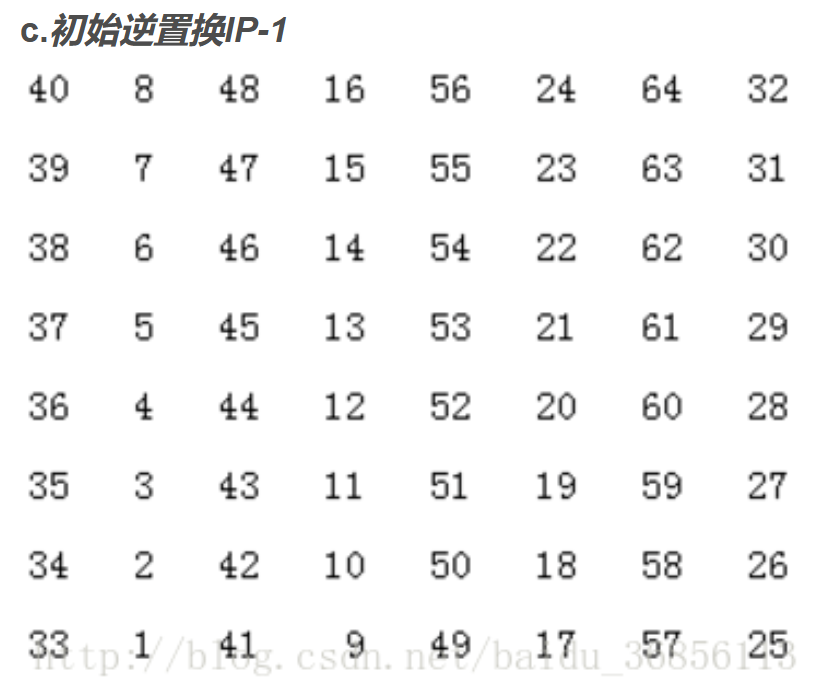
#### DES有雪崩效应
一个密钥位或明文位bit变化导致密文至少1/2变化。这种变化的大量传播效应称为**差分Differential**。密码机制设计时要求差分快、广。
#### 缺陷以及改进
密钥空间太小。
##### 2/3DES
3DES:2/3个不同密钥，进行加(E)解(D)密，如E(k1)D(k2)E(k1/k3)、DED,解密时需要反过来DED、EDE。增大了密钥空间但没有增大分组大小，分组空间置换时仍然有限制。
然而，2/3DES中，已证明DES不是一个群，即加法（2DES、3DES）后不在原DES中，不能直接映射到1-DES。
多用于应用层协议，如PGP或SMTP
###### 中间人攻击
对于2-DES，有$p→_{(Des_1)}X_1→_{(Des_2)}c$，当中间人得到$p$和$c$时，穷举左侧加密DES(p)($2^56$)得到$X_1$，穷举右侧解密DES(c)($2^64$)得到了一个$X_2$，若$X_1=X_2$，则大概率得到了密钥$K_1,K_2$
###### 解决方法
可以使用更高安全的算法叠，例如第一次加密使用DES（2*64位），第二次加密使用AES（128位）
###### 中间相遇攻击
MITM(Meet in the middle)
在点到点链路上，每个点node都可能被攻击（如PPTP的VPN）。而用户希望端到端的安全。则需要保证每个点安全。
不依赖任何分组密码的性质，适用于任何密码。
###### 流程
在Internet上传输数据时，在某个节点（node）进行监控和修改。
## AES算法
SPN Structure 十轮(若是16字节子密钥)；密钥长度128/192/256位；分组长度128bits。所有加减乘除运算都是在$GF(2^8)$上定义的。
- GF群：
    - 普通群中，可能存在某些数没有乘法逆元，为了解决这个问题定义$GF(2^n) = sum{0}{n-1}{a_i*2^i}$的一个多项式，$a_i$仅取0，1；则整个群中有$2^n$个元素。
    - 系数运算以2为模；当乘法运算后多项式次数超过了n-1，则需要用一个不可约多项式m(x)（不能被次数小于m(x)的两个多项式来乘法表示，有多个，可任选，但运算效率不同）来取模。
    - **所有运算都是对于多项式的运算，只不过显示为系数**
- 算法输入：128位的分组，即16字节，**将16字节分成一个4×4矩阵**，按列排序，前4字节放在第一列，4-8第二列...。
- 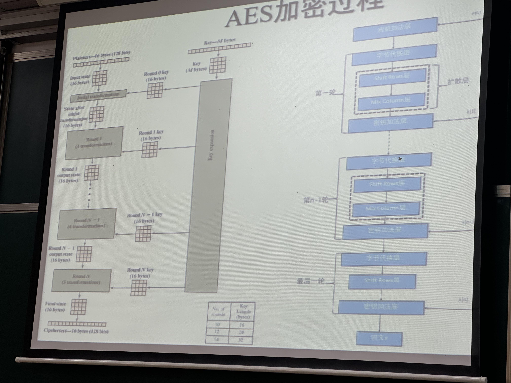
### 密钥生成
- m位密钥变为方阵，初始变换和每轮都选取一个16字节（128位）的4×4方阵作为子密钥。
- 密钥拓展：输入一个4字(16字节)主密钥的4×4方阵，输出一个44字的矩阵:11×4，为初始变换和10轮提供子密钥。
### 算法解释
- 开始轮函数前和结束后，需要用一个子密钥先进行依次KeyAdd，引入随机性：前/后期白化，加入白噪声。
- 一个轮函数是可逆的，有四层。
    1. 字节代换(S盒子SBox):
        1. 唯一一个非线性的函数。
        2. 在$x 属于 GF(8)$中，$y=f(x) = x^{-1}(x的逆元) = x^{254} mod 不可约多项式$(在GF(8)下)。则选取一个不可约多项式，所以可以构造一个SB表，表头为${X,X^_{-1}}$，则只需要256字节表。$x^{-1}(x的逆元) = x^{254}$原因：$x × x^{254} = 1$(即e单位元)
        3. 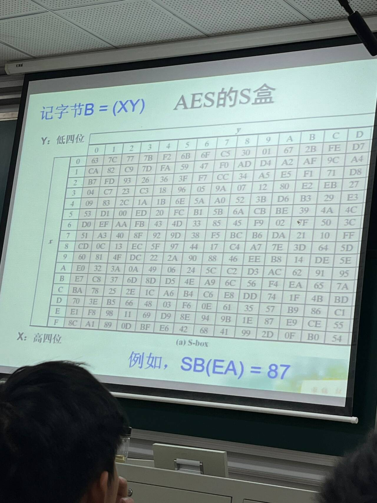
    2. Shift Row置换层(只涉及到矩阵旋转，是对于一行的循环。从第一行开始循环左移0,1,2,3...。不改变值只改变位置)
    3. 列混淆变换Mix Col层：有一个列混淆矩阵U，一个逆矩阵W：WU=E（单位矩阵）；则原矩阵S混淆$S' = US$；逆变换$S = WS$。不仅变换了位置(置换)，也进行了混淆。
    4. 密码加KeyAdd:可逆层，$y <- x \oplus sk_n$；$x <- y \oplus sk_n$
- 最后一轮没有Mix Col
### 加密效果
- 雪崩效应：很强，明文或密钥的任何bit改变影响密文所有字节。在没有密钥时看上去完全随机。
### 算法实现
- AES加解密过程是不同的，置换ShiftRow和列混淆的混淆矩阵不同，需要不同的函数软件实现。
- 需要两步操作：
    1. 交换解密算法的字节替换和逆向Shift Row两层
    2. 交换解密算法的轮密钥加(KA)和逆向列混淆(MC)两层：$MixCol^{-1}(S \oplus Key) = MixCol_{-1}(S) \oplus MixCol_{-1}(Key)$
## 分组密码分析
对于2-DES，中间人攻击复杂度$2*{2^56}$，而直接穷举时复杂度$2^{56 * 2}$，差距很大。即不同攻击方法的效率差距极大。
### 差分分析（不理解）
选择明文攻击，典型的统计分析方法。
#### 基本思想
**对某些明密文对，分析多个明文对之间的差距，统计密文对的差异，恢复某些密文。**对于明文对$p_1p_2$，计算$\Delta_p = p_1 \oplus p_2$，$\Delta_f = f(p_1) \oplus f(p_2)$。分析两个差异，尝试恢复部分key。**实际上只关心$\Delta$，即明密文对的差分，不关心实际明密文对**
在DES的差6轮中，差分分析的搜索空间很大。
#### 查分过程
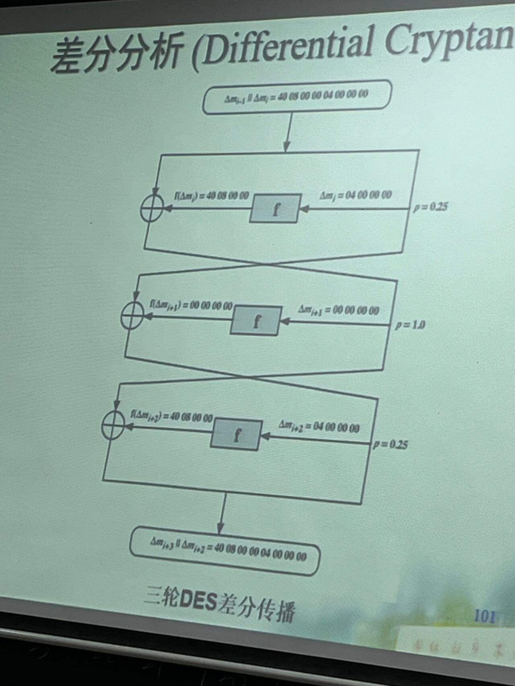
对于明文对差分$x_1\oplus x_2$，某一轮中$L_1$直接放入$R_2$,得到差分结果是1；$R_1$经过$L1 \oplus f(x_1) \oplus f(x_2) \oplus k_1$，当别的不变，只改变K时，以另一概率(0.25)出现另一个差分$L_2$。经过三轮DES后，从输入差分变为输出差分后概率为0.25×1×0.25。**攻击时挑选概率最大的差分对应的Key即可**。
#### 差分均匀
如果无论改变key的值，所有输出差分的概率都是一样的，那就完全安全，差分分析不可用。
### 线性分析
已知明文攻击
#### 基本思想
寻找明文、密文、密钥比特之间对高概率或低概率的**线性逼近**，尝试恢复某些密钥的比特位。
#### 分析过程
设计一个线性过程，概率逼近加密过程中的**非线性部分**。以DES为例，计算$\Delta X=linear(x) \oplus f_k(x)$，降低$\Delta X$的Hamming重量（1比特数量）。复杂度极高。
### 侧信道攻击
Side-Channel Attack，SCA
利用密码系统的物理实现中获取的物理特征进行密码分析。分析运行时间、功率消耗、电磁辐射、声音等。