# 密码学
# 第一章
## 计算机安全的核心目标： 
- 保密性(Confidentially)
  - 数据保密性：**隐私信息不被非授权者查看或使用**
  - 隐私性：确保个人能**控制或确定**哪些信息可以被收集和保存、谁能公开、向谁公开C
- 完整性(Integrity)
  - 数据完整性：信息和程序只能**以授权的方式进行改变**
  - 系统完整性：确保系统以正常方式运行，**避免非授权操作**
- 可用性(Availability)：确保系统迅速反应，且**对授权用户不能拒绝服务**
以上统称为CIA原则
- 更多：
  - 真实性：要能够确保**可被验证和可被信任**，即能确保用户是他声明的那个用户、系统的输入都是来自可靠信源。
  - 可追溯性：每个实体的行为必须可**唯一追溯**到该实体。要能够追查到安全泄露的那一方。
## 缺失定义
- 保密性缺失：信息的非授权**泄露**
- 完整性缺失：信息的非授权**修改和毁坏**
- 可用性缺失：对信息与信息系统的**访问和使用的中断**
## 安全攻击
- 被动攻击：对传输进行**窃听和监测**
- 主动攻击：对数据流进行**改造或伪造**数据流
 - 伪装：伪装成另一个实体，例如截获有权限方的认证信息，完成认证后重放信息，即可获得额外权限。
 - 重放：将截获的信息再次发送
 - 消息修改：未经授权**修改合法消息**的某一部分、延迟消息传输、改变消息顺序。
 - 拒绝服务
## 安全服务
一种由系统提供的**对系统资源进行特殊保护**的处理或通信服务。安全服务通过安全机制来实现安全策略。
# 数论基础
## 整除性与带余除法
$b|a$:b整除a，b是a的因子；例如3|9、4|24
- 性质：
  - $a|1 -> a=\pm1$
  - $a|b且b|a -> a = \pm b$
  - $任何非0整数n|0$
  - $若b|g且b|h，则对于任意整数m、n，有b|(mg+nh)$
## 欧几里得算法
### 最大公因子gcd
gcd(a,b)，表示能同时整除a、b的最大整数，一定是正数。
- gcd(0,0) = 0
- gcd(a,b) = 1，则a、b互素
- gcd(a,b) = gcd(|a|,|b|)
- gcd(a,0) = |a|
### 欧几里得算法计算
gcd： 设$a\geq b > 0$，求解$d = gcd(a,b)$。
  1. 计算a与b的余数r1，得到$a = q_1b + r_1$
  2. 若$r_1 \neq 0$，则用b替换a，$r_1$替换b，计算$b = q_2r_1 + r_2$
  3. 若$r_2=0$，则$r_1$为最大公因子d
  - 即计算$d = gcd(r_1,r_2)$，若余数$r_3$为0则余数为$r_2$，否则$d=gcd(r_2,r_3)$
  ```Python
  def gcd(a,b):
    #递归算法
    r = a % b
    if r == 0:
        return b
    else:
        return gcd(b,r)
  ```
### 拓展欧几里得
- 同时计算出一个gcd(a,b)，且计算出$x、y$，使得$ax+by=gcd(a,b)$。其中x、y有着相反的正负号。
- 计算过程：
  1. 使用欧几里得算法计算d=gcd(a,b)，但记录下所有r（余数）和q（带余除法的结果）。
  2. 设$x_{-1}=1,y_{-1}=0,x_0=0,y_0=1$
  3. 计算$x_i=x_{i-2}-q_ix_{i-1}，y_i=y_{i-2}-q_iy_{i-1}$，对于每个i，都满足$r_i=ax_i+by_i$
  4. 计算到$i=n时r_{n+1}=0$，可以得到gcd(a,b)为$r_{n}$,要求的$x=x_n,y=y_n$。
- 利用拓展欧几里得求逆元：在模n下a的逆元x，若$ax \equiv 1(\mod n)，则ax = bn + 1，则ax+bn=1。$则可以用于计算a、n互素时，a的逆元(**只有当a、n互素时才有逆元**)：直接计算extended_gcd(a,-n)，得到的x就是a的逆元。
- ```Python
  def extended_gcd(a,b):
      x = [1,0]
      y = [0,1]
      i = 2
      r = 1
      while r != 0:
          r = a % b
          q = a // b
          if r == 0:
              return b, x[len(x)-1], y[len(y)-1]
          a = b
          b = r
          x.append(x[i-2] - q * x[i-1])
          y.append(y[i-2] - q * y[i-1])
          i += 1
  ```
## 模运算mod
$a/n = q 余 r$，r即为$ a \mod n $
### 同余
- 若$a\mod n = b\mod n$，称为a、b模n同余。记为$a\equiv b(\mod n)$
- $a\equiv 0(\mod n)，则n|a$
- 性质:
  - 若$n|(a-b)，则a \equiv b (\mod n)$
  - 若ab模n同余、bc模n同余，则ac模n同余
  - $a \equiv b (\mod n)则b \equiv a (\mod n)$
  - 若$(a+b) \equiv (a+c) (\mod n)，则b \equiv c (\mod n)$
  - **当a与n互素时**，若$(a×b) \equiv (ac) (\mod n)，则b \equiv c (\mod n)$。原因：如果a与n互素，则$Z_n$中的所有数乘以a可以得到完整的$Z_n$，而如果不互素，则得不到完整剩余类集。
### mod运算性质
- $(a+b) \mod n = (a \mod n + b \mod n) \mod n$
- $(a-b) \mod n = (a \mod n - b \mod n) \mod n$
- $(a×b) \mod n = (a \mod n × b \mod n) \mod n$
### 模运算中定义：
- 负数（加法逆元）：a的负数b满足：$a+b = 0$。例如在模8运算中，3的负数是5。在加法运算表中，**所有0元素对应的行列互为加法逆元**。
- 倒数（乘法逆元）：a的乘法逆元满足：$a×b = 1$。例如在模8运算中，3的乘法逆元为3。在乘法运算表中，**所有1元素对应的行列互为乘法逆元**。#注：并非所有元素都有乘法逆元。
### 剩余类
n的剩余类（集）：$Z_n = \{0,1,2,...,n-1\}$，定义为小于n的所有非负整数。剩余类表示为$[0]、[1]、...、[n-1]$，其中$[r] = \{a:a为整数，且a \equiv r (\mod n)\}$，但一般直接用$r$表示剩余类。
## 素数
- 任何整数a>1，都可以分解为多个素数的乘积：$a=p_1^{a_1}×p_2^{a_2}...×p_n^{a_n}$
- $a=\prod p^{a_p}，b=\prod p^{b_p}$，其中$p$是某个整数，而$a_p$表示整数的指数，若$a|b$，则有$a_p \leq b_p$
- 若$k = gcd(a,b)，那么k_p=min\{a_p,b_p\}$
## 费马定理与欧拉定理
### 费马定理
- 若p是素数，且p不能整除a，则$a^{p-1} \mod p 余数永远为1$。即$a^{p-1} \equiv 1 (\mod p)$
- 若p是素数，a是**任意正整数**，则有$a^p \equiv a (\mod p)$
### 欧拉函数
- $\phi(n)表示小于n且与n互素的元素个数，\phi(1)=1,\phi(4)=count([1,3]=2)$
- 对于一个素数p，总存在$\phi(p)=p-1$
- 对于素数p、q，n=pq有$\phi(n)=\phi(pq)=\phi(p)\phi(q)=(p-1)(q-1)$
- 欧拉定理：
- 对于任意互素的$a、n$，存在$a^{\phi(n)} \equiv 1 (\mod n)$
- 对于任意互素的$a、n$，存在$a^{\phi(n)+1} \equiv a (\mod n)$
- 中国剩余定理：
- 求解一元线性同余方程组：对于一个物品有c个， 每组p1个数剩r1，每组p2个数剩r2...
### 中国剩余定理形式
##### 书上的形式
对于一个$M = m_1 × m_2 × ... ×m_k$，其中所有$m$之间两两互素，则$Z_M={1,2,3...,M-1}$中的任意一个数$A$可以由一个k元组$a_1,a_2,...,a_k$组成，其中$a_i \in Z_{m_i}$且有$a_i = A \mod m_i$。
- 简单来说，一个小于$M$的$A$值可以由一个方程组组成，方程组中方程的个数为组成M的两两互素的数的个数，且$a_i = A \mod m_i$。
- 有两个断言：
  - 对于每个$A$，所能组成$A$的k元组，即方程组是唯一的。且对与一个k元组，只能对应一个A。这样就可以使模 大数 的运算转变为模 小数 的运算。
  - 在k元组中的运算可以直接映射到对于$A$、$M$中的运算。例如$A$对应了2元组$a_1$,$a_2$，$B$对应了2元组$b_1$,$b_2$，则$(A+B) \mod M$对应的2元组就是$(a_1 + b_1 \mod m_1,a_2 + b_2 \mod m_2)$
  - 这有什么好处？可以用来加速大数的计算。首先，将大数M分解为多个互素的数相乘:$M=m_1 × m_2 ... × m_k$。接着将要运算的数字分解为k元组的形式，并在k元组下进行运算。
- 如何将一个$A$分解成k元组？
  1. 从$A$转换到k元组：计算$a_i = A \mod m_i$即可。
  2. 从k元组转换回$A$：
     1. 对于每个$a_i$，计算一个$M_i = m_1 × m_2 ×...×m_k$，除了$m_i$都要乘，则$M_i \mod m_j = 0 j \neq i$，且$M_i$与$m_i$互素
     2. 计算$c_i = M_i × (M_i^{-1} \mod m_i)$。由于$M_i$与$m_i$互素，所以可以得到$M_i$在$\mod m_i$下唯一的逆元。
     3. 计算$A = \sum_i^k c_i × a_i$
##### 求解线性同余方程组

1. 将原问题分解为：$X=X_1+X_2+...+X_n$，其中$X_1 \mod p_1 = r1$，而$X_1 \mod p都为0$；$X_2 \mod p_2 = r_2$,$而X_2 \mod其他p均为0......$
2. $将X_i转换为Y_i，其中，Y_i \mod p_i = 1$，而mod任意其他均为0，则需要求解的数字$X=\sum Y_i×r_i$
3. 由于$Y_i \mod 任意其他p均为0$，则$Y_i = k_i * \prod_{k,k\neq i} r_i$。由于$Y_i \mod p_i = 1$，则有$k_i * \prod_{k,k\neq i} r_i \equiv 1 (\mod p_i)$，则就是求$Y_i在模p_i下的逆元$
    ```Python
    import euclid_gcd as g
    def china(rs,ps):
        #转换为求解逆元的过程
        X = 0
        for i in range(len(rs)):
            y_e = 1
            for j in range(len(rs)):
                if j != i:
                    y_e *= ps[j]
            _,k,_ = g.extended_gcd(y_e,ps[i])
            X += rs[i] * k * y_e
        return X 
    ```
## 离散对数
### $\mod n$的整数幂
- 对于欧拉定理$a ^ {m} \equiv 1 (\mod n)$，有例如$m = {\phi(n)}$，则称最小的$m$为$a(\mod n)$的阶，$a$所属的模$n$的指数、a产生的周期长。例如：$7^3 = 343$，$343 \mod 19 = 1$，所以$7$在模$19$下周期为$3$.
- 本原根：若一个数$a$（在模$n$下）的阶为$\phi(n)$，则称之为本原根。实际上，$a$的阶（周期）大小表示了在不同指数运算下，它能生成多少个$Z_p$下的数字，若阶是$\phi(n)$，就说明$a$能够生成$Z_n$下的最多数字(**不一定是所有数字，而是与$n$互素的所有数字**),即$$a,a^2,a^3...,a^{\phi(n)}$$都不同，且都与$n$互素。**注意：$m$是指最小的能满足$a ^ {m} \equiv 1 (\mod n)$的数，不一定是$\phi(n)$所以即使$n$是一个素数，也不代表所有$Z_n$都是$n$的本原根**
### 模算数下的对数
对于$(mod p)$运算下，任意一个整数$b$都有$b \equiv a ^ i (\mod p)$,其中，$a$是$p$的一个本原根，$i$是某个数，称$i$为以$a$为底(模$p$下)的$b$的离散对数$d\log_{a,p}(b)$。
- 模算数下的对数拥有和普通对数下的相似性质.
- 计算$y = g ^ x \mod p$是很轻松的,但如果只知道$y、g、p$那就很难计算出$x$.
## 素数判断
- Rabin-Miller算法
  - 随机选取一个a，一次遍历后通过测试的概率是$\frac{1}{4}$
    - 首先对于一个**奇整数n**，可以分解为n-1=$2^kq$，其中$q$是奇数。
    - 随机选取一个$a(1<a<n-1)$
    - 从$j=[1,k-1]$开始计算，若j=1时，$a^{2^jq}=a^{q} \mod n=1$，则返回**不确定**
    - 若$j \neq 1$，若存在$a^{2^jq} \mod n = n-1$，则返回不确定
    - 遍历完所有$j$后仍未返回不确定，则就是合数。
  - 选取多个不同的随机a进行测试，t次遍历后一个合数仍能通过测试的概率为$(\frac{1}{4})^t$
  
  ```python
  import random
  def rabin_miller(n,t):
    if n % 2 == 0:
        print(f"{n}是合数")
    #随机选取t个a
    aa = []
    while len(aa) < t:
        rint = random.randint(2,n-2)
        if aa.count(rint)==0:
            aa.append(rint)

    #将奇整数分解
    k = 1
    while int((n-1) / (2 ** k)) % 2 == 0:
        k += 1
    q = int((n - 1) / (2 ** k))

    #j = 0时，查看是否a^q mod n为1
    for a in aa:
        flag = False
        if (a ** q) % n == 1:
            flag = True
        if not flag:
            for j in range(0,k):
                if (a ** ((2 ** j) * q)) % n == n-1:
                    flag = True
                    break
        if not flag:
            print(f"{n}是合数")
            return
    print(f"在{t}次测试下，{n}均通过测试，可能是素数") 
  ```

# 群论基础
抽象代数中，考虑**元素进行代数运算的集合**


- 根据元素个数是否有限，分为有/无限群环域
- **阶数**：群/环/域内元素个数
## 群
群是一个**二元运算**的集合。记作$G\{G,·\}$。$G$是一个元素集合，$·$是一个运算。
- **群**有如下性质：  
  1. (加法)封闭性A1：若$a,b \in G$，则$a · b \in G$。即两元素运算后的结果仍然在群中。
  2. (加法)结合律A2：$a · (b · c) = (a · b) · c$
  3. (加法)单位元A3：存在一个单位元$e$，使得任意$a \in G$有$a · e = e · a = a$
  4. (加法)逆元A4：对于任意$a \in G$，存在一个$a' \in G$，使得$a · a' = e$
- **交换群**有如下性质：
  1. 是一个群A1-A4
  2. (加法)交换律A5：$a · b = b · a$
- \*循环群有如下性质：
  - 定义幂运算$a^k = a · a ·...$;$a_0 = e$;$a_{-k}=a'^k$
  1. 是一个群，群中只由一个元素$a$以及$a^k$组成。一定是交换群。
## 环
环有两个二元运算，记作$R=\{R,+,×\}$。在环上进行加减乘不脱离集合。
- **环有**如下性质：
  1. $R$关于加法是一个交换群，即满足A1-A5
  2. 乘法封闭性M1
  3. 乘法结合律M2：$a × (b × c) = (a × b) × c$
  4. 乘法分配律M3：$a×(b+c)=a×b+a×c$
- **交换环**有如下性质：
  1. 是一个环：A1-A5，M1-M3
  2. 乘法交换律：M4
- **整环**有如下性质：
  1. 是一个交换环
  2. 乘法单位元M5**1**
  3. 无零因子M6：存在一个0，使得如果$a × b = 0$，则必有$a = 0或b = 0$
## 域
域有两个二元运算，记作$\{F,+,×\}$。在域中进行加减乘除而不脱离域。
- **域**满足：
  1. 是一个整环。A1-A5，M1-M6
  2. 乘法逆元
## 总结图

## 有限域GF(p)
有限域中元素的个数一定是$p^n$，其中$p$为素数。\\
- GF(p)定义为整数$\{0,1,2,3...,p-1\}$的集合$Z_p$，其中**p是一个素数**，加乘要模p。
- 最有意义的是GF(2)，在GF(2)中，加法等同异或，乘法等同逻辑与。
### 乘法逆元
- 元素$a$的乘法逆元$a'$就是满足$a×a'=e$(单位元)的元素。
- 只有当$GF(p)$中的$p$为**素数**时，才能保证$Z_p$中的每个元素都有逆元。**当不满足$p$为素数时，$Z_p$仅能构成一个交换环**。
##### $Z_p$上求乘法逆元：拓展欧几里得算法
若$b$与$p$互素，即$gcd(b,p)=1$，则可知在$Z_p$上$b$一定有乘法逆元$b' < p$。
1. 此时要计算$b$在$\mod p$下的乘法逆元(即$b×b' \mod p = 1$)，可以构造函数：$(px + by) \mod p = gcd(b,p) = 1$。
**为什么能这么构造？**
本身想要求出$b'$的值，即求解方程$b×b'=0$，就可以利用$gcd(b,p)=1$，发现这个式子的拓展欧几里得就是要求的方程。
1. 得到$px \mod p + by \mod p = 0 + by \mod p = gcd(b,p) = 1$
2. 使用扩展欧几里得算法，得到的$y$就是b的乘法逆元$b'$
### 多项式运算
$f(x) = \sum{i}^{n} a_ix^i$;其中$a_i$称为系数集S,$a_n \neq 0$。若$a_n = 1$，则称为**首一多项式**。$x$称为**变元或不定元**。
- 系数集S是环，则不一定有除法定义，可能导致不能整除(例如整数域)；系数集S是(有限)域，也不一定整除(例如实数域、素数域)，可能会有余数。定义有限域S内的多项式除法如下：
  - 一个$n$次多项式$f(x)$，$m$次多项式$g(x)$，计算$\frac{f(x)}{g(x)}$，商式为$q(x)$，余式$r(x)$，则得到一个带余数的式子$f(x) = q(x)g(x) + r(x)$。
  - 如果允许存在余数$r(x)$，则称有限域F内多项式除法是**可能的**。将余式记作$r(x) = f(x) \mod g(x)$；若$r(x) = 0$，则$g(x)$整除$f(x)$，记作$g(x)|f(x)$
- 如果系数域F中某个多项式$f(x)$**不能表示为任何F中其他多项式的乘积**，则称$f(x)$为素多项式。
- 多项式加减乘除：
### 求最大公因式
类似普通的欧几里得算法，有$gcd(f(x),g(x))=gcd(g(x),f(x) \mod g(x))$并辗转相除
## 有限域$GF(2^n)$
### 为什么要引入$GF(2^n)$
- 一个有限域必元素个数必须是$p^n$,$p$是素数。然而$Z_{p^n}$并不是一个域，因为$p、p^2、p^3...$都没有乘法逆元。**所以需要通过多项式运算来构造出一个域**。
- 计算机中的n位字，希望可以构造一个域，元素范围在$[0,2^{n}-1]$。然而，普通的$GF(2^n)$并不是一个域，因为$2^n$不是一个素数。则额外在系数为$GF(2)$的n项的**多项式上**定义一个$GF(2^n)$,有如下性质。
- 优势：如果只使用加法和乘法域也不行：乘法表中每个元素出现次数不同，存在统计规律。而多项式下的$GF(2^n)$是一个域，每一个元素在加减上都有逆元。且在加减乘除运算中，每个元素出现次数是均匀的，适合密码算法。
### **多项式的模运算**
- $GF(p^n)$，是所有由系数是$Z_p$，且有n项的多项式组成的集合（如$p=2,n=3$，则有8个项）。要满足域条件，需要满足：
  1. 加与乘满足普通多项式运算规律。
  2. 系数运算以p为模，即系数在$Z_p$中。
  3. 乘法运算结果的最大次数$\leq n-1$，若超过则要使用一个n次(n+1项)不可约多项式$g(x)$(某个素多项式)取模。即$f'(x) = r(x) = f(x) \mod g(x)$
- 在不可约多项式的模下，可以使用扩展欧几里得算法计算某个多项式的乘法逆元：
  1. 对于一个不可约n次多项式$g(x)$，一定有$f(x) \in GF(2^n)$，使得$gcd(f(x),g(x))=1$
  2. 则有$f(x)×\phi_1(x) \mod g(x) + g(x)×\phi_2(x) \mod g(x) = 1$，即$f(x)×\phi_1(x) \mod g(x) = 1$，计算的$\phi_1(x)$就是$f(x)$的乘法逆元。
### $GF(2^n)$下的小技巧
1. 计算$x^n \mod p(x) = p(x) - x^n$，其中$p(x)$是既约多项式。
2. 在$GF(2^8)$(AES使用的)下计算$x(00000010) × m(x) \mod p(x)()$，只需要按照如下条件运算即可。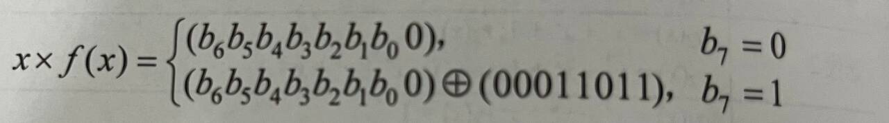
3. 使用生成元：
##### 生成元
一个阶为$q$的域F的生成元g是一个元素，$0,g^0,g^1,g^2...,g^{q-2}$构成了F的所有元素。
##### 本原多项式
1. 根：一个由$f(x)$定义的域F(不是$GF(2^n)$，而是一个多项式$f(x)$，其中的元素是$x$)，如果一个元素b导致多项式f(b)=0，则称这个元素是多项式$f(x)$的根。**简单来说就是解方程f(x) = 0的那个x**
2. 本原多项式：值$GF(p)$上的某个首一多项式$f(x)$，它是所有其他非零元素生成元。而且有性质：$x^{p^n-1} \mod f(x) = 1$
# 分组密码
密钥、明密文通常用16进制表示
## Feistel密码体制
- DES、CAST、BlowFish密码等
- 轮询密码。将输入分为两组进行加密。这个过程类似异或，是可逆的。**将输出两组互换作为输入重新计算一次就会变回来**。


- 特点：计算快捷方便。不要求轮函数可逆，基于伪随机。有多轮；每轮有异或等可恢复操作；有**轮函数**。
### Feistel设计原理
1. 迭代轮数选择:轮数越多越难攻击,要求是**使密码分析的难度大于简单穷举**.
2. 轮函数F/子密钥生成:非线性越多就越难攻击,越难用一个线性函数拟合F就越安全.需要满足严格雪崩准则、位无关准则:
> 严格雪崩：S盒子输入的任意一位i发生了变化,则输出的任意一位j发生变化的概率为$\frac{1}{2}$
> 位无关：输入的任意一位i发生变化，输出中的位j和位k彼此之间相互无关。
## DES算法(Feistel体制)
分组长度：64比特；密钥长度：56比特（密钥加长难以穷举）；轮数：16（轮数增加难以密码规律分析,需要至少$2^{47}$个选择明文或$2^{55.1}个已知明文$）
### DES流程：
#### 总体结构

#### DES初始化操作
1. 将文本转变为二进制数形式。分为64位的多个组Group；如果某个组不足64位，则需要补0padding。
2. 将每个组放入IP初始置换中进行置换。IP类似洗牌，固定可逆，有一张IP置换表，表中数字i表示用第i个index的值替换。[IP](image-2.png)
#### DES轮加密操作
1. 每一轮会将64位组分为$L_iR_i$左右32位两部分。
2. 首先，将$R_i$进行拓展置换为48位；
 通过原56bit的密钥生成一个48位的子密钥$K_i$。计算48位的$R_i \oplus K_i$。
  - R的扩展：
  - 密钥调度算法(Key Schedule Algorithm)：将64位主密钥(其中8位是奇偶校验位，不起加密作用)分为16个48位子密钥。
      - 
      - 置换1(PC1)：。丢弃每8位的最后一位，即奇偶校验位。
      - 置换2(PC2)：
1. 将$R_i \oplus K_i$放入**非线性S盒**中，将48位映射到32位，是一个压缩函数。    
  - S盒：
  - S1盒(4 * 16) 
2. 再将S盒输出的32位放入P盒中置换，得到轮密钥RoundKey。将$RK$与$L_i$异或后得到下一组的$R_{i+1}$。将原$R_i$直接放到$L_{i+1}$即完成一轮加密。
- 末置换FP：是IP的逆过程。
#### DES有雪崩效应
一个密钥位或明文位bit变化导致密文至少1/2变化。这种变化的大量传播效应称为**差分Differential**。密码机制设计时要求差分快、广。
#### 缺陷以及改进
密钥空间太小。
##### 2/3DES
3DES:2/3个不同密钥，进行加(E)解(D)密共三次，如E(k1)→D(k2)→E(k1/k3)、D→E→D,解密时需要反过来D→E→D、E→D→E。增大了密钥空间但没有增大分组大小，分组空间置换时仍然有限制。
然而，2/3DES中，已证明DES不是一个群，即加法（2DES、3DES）后不在原DES中，不能直接映射到1-DES,**也就是说DES多加几轮是有用的**。
多用于应用层协议，如PGP或SMTP
###### 计时攻击
根据加解密不同输入所花时间的差异进行分析汉明权重,DES能防止这种攻击。
###### 中间人攻击
对于2-DES，有$p→_{(Des_1)}X_1→_{(Des_2)}c$，当中间人得到$p$和$c$时，穷举左侧加密DES(p)($2^56$)得到$X_1$，穷举右侧解密DES(c)($2^64$)得到了一个$X_2$，若$X_1=X_2$，则大概率得到了密钥$K_1,K_2$
###### 解决方法
可以使用更高安全的算法叠，例如第一次加密使用DES（2*64位），第二次加密使用AES（128位）
###### 中间相遇攻击
MITM(Meet in the middle)
不依赖任何分组密码的性质，适用于任何这样的密码。
适用于2-DES.
1. 对于2-DES,有$c = E(k_2,(E(k_1,m)))$,则解密$m = D(k_1,D(k_2,c))$,有$x = E(k_1,m) = D(k_2,c)$.
2. 先遍历$k_1$,计算$E(K_1',m)$的$2^{56}$种情况并排序,再计算$D(k_2',c)$,一共可以计算出$2 ^ 48$个满足$m → c$的$(k_1、k_2)$对。
3. 选择几个新的已知明文对,如果某个密钥对$(k_1,k_2)$可以成功解密,则说明成功,成功概率为$\frac{2^{48}}{2^{64}}=2^{-16}$
###### 攻击3-DES 
1. $p→_{Ek_1}A→_{Dk_2}B→_{Ek_1}c$,选择能让$A=0$的明密文对,简化为中间相遇,需要$2^{56}$个选择明文.
2. 有n个已知明密文对$(p,c)$
   1. 选一个任意$A$的$a$值,穷举$2^{56}$个$k_1$,使得$p→a$,将满足条件的p加入表格2(k_1,B)中. B由$D(k_1,c)$解的.
   2. 穷举$2^{56}$个$k_2$,求得能使$a→B$的密钥对,保存为$(K_1,k_2)$ 
   3. 测试其他数个明密文对,如果成功解密就得到了密钥,否则换一个$a$值继续攻击.
3. 这些攻击不实际.
## AES算法
AES被定义在多项式有限域$GF(2^8)$(Galois域)下(8位二进制数=1字节)。运算时系数以2为模。表示时不写$x$而只写系数，例如$01100110$等。选取的既约多项式为$x^8+x^4+x^3+x+1$，即$100011011$。
### AES基础设定
- SPN Structure 十轮(若是16字节子密钥)；密钥长度128/192/256位(16/24/32字节)；分组长度128bits(16字节)。所有加减乘除运算都是在$GF(2^8)$上定义的。
- 算法输入：
  - 128位的分组，即16字节，**将16字节分成一个4×4矩阵**，按列排序，前4字节放在第一列，4-8第二列...。
  - 将128位密钥生成为4字节(w，1字)×44的密钥序列，每轮加密取出4列共16字节作为轮密钥。128位加密10轮+第0轮初始置换；192位加密12轮；256位加密14轮。
- AES不是一个Festile结构：未使用半个分组修改另一半，而是将整个分组转换为4×4矩阵整体置换和混淆

### 密钥生成
- m位密钥变为方阵，初始变换和每轮都选取一个16字节（128位）的4×4方阵作为子密钥。 
- 密钥拓展：输入一个4字(16字节)主密钥的4×4方阵，输出一个44字的矩阵:11×4，为初始变换和10轮提供子密钥。
### 算法解释

##### 前后期白化：轮密钥加
- 开始轮函数前和结束后，需要用一个子密钥先进行依次KeyAdd，引入随机性：前/后期白化，加入白噪声。
- 为什么要加入前后期的轮密钥加？**因为整个算法中用到密钥的只有每个轮函数的轮密钥加**，对于其他不需要密钥的运算来说可以轻松逆向得到上一步的结果，所以在头尾增加轮密钥加以增加安全性。
##### 轮函数
一个轮函数是可逆的，有四层。
###### 字节代换(S盒子SBox)
1. 唯一一个非线性的函数(**因为使用了乘法逆元**)。正/逆向变换通过查表实现。一个字节8位，高4位构成一个0-15的值作为S盒的行序号，第四位作为列序号，定位到S盒子的某个位置。
2. 如何计算出S盒子每个位置的值？
   1. 首先初始化S盒子表：按照字节升序，第一行是01、02、...、0F；第二行是11、12...、1F
   2. 接着计算x行y列位置的S盒子值：计算s[x][y]在$GF(2^8)$下的乘法逆元$s^-1[x][y]$，00映射为00。
   3. 对每个xy位置的字节计算一个变换：$b_i'=b_i \oplus b_{i+4 \ mod 8} \oplus b_{i+5 \ mod 8} \oplus b_{i+6 \ mod 8}\oplus b_{i+7 \ mod 8} \oplus c_i$,其中$c=01100011$.**加c的作用:使得S盒子中没有不动点和反不动点**
   4. 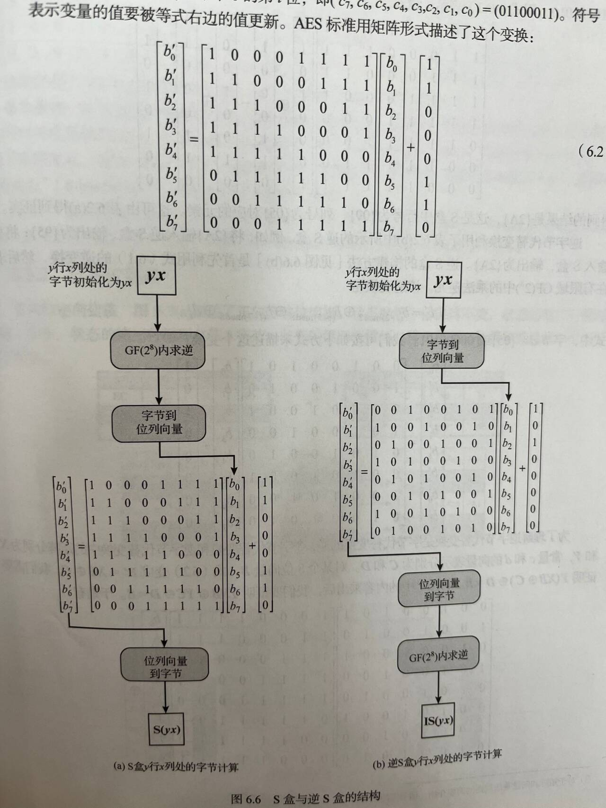如图构造的原因：在$GF(2^8)$下，系数是模2运算的，**所以加法等同与异或，乘法等同于和**。这个矩阵相乘相当于是3中的变换。
3. 如何计算逆S盒子每个位置的值？
   1. 利用上面2.3中变换的逆变换(反过来异或)之后，再求乘法逆元即可。
   2. 事实上，正向S盒子X和逆向S盒子Y相互为逆矩阵，即$XY=I$(单位矩阵)。
   3. S盒子和逆S盒子不是自逆的,$S(a)\neq inv_S(a)$
4. 
###### 置换层:行移位
Shift Row置换层。
- 正过程：对于4×4矩阵，第一行不变，第二行左移1位，第三行2位，第四行3位。
- 逆过程：循环右移。
- 将一个字节从一列移动到另外一列之后用轮密钥加密。确保了一列中的4字节被拓展到四个不同得列。
###### 列混淆
列混淆变换Mix Col层。
- 所有加法和乘法都是在$GF(2^8)$域上的。
- 有一个列混淆矩阵U，一个逆矩阵W：WU=E（单位矩阵）；则原矩阵S混淆$S' = US$；逆变换$S = WS'$。不仅变换了位置(置换)，也进行了混淆。
- 正向变换：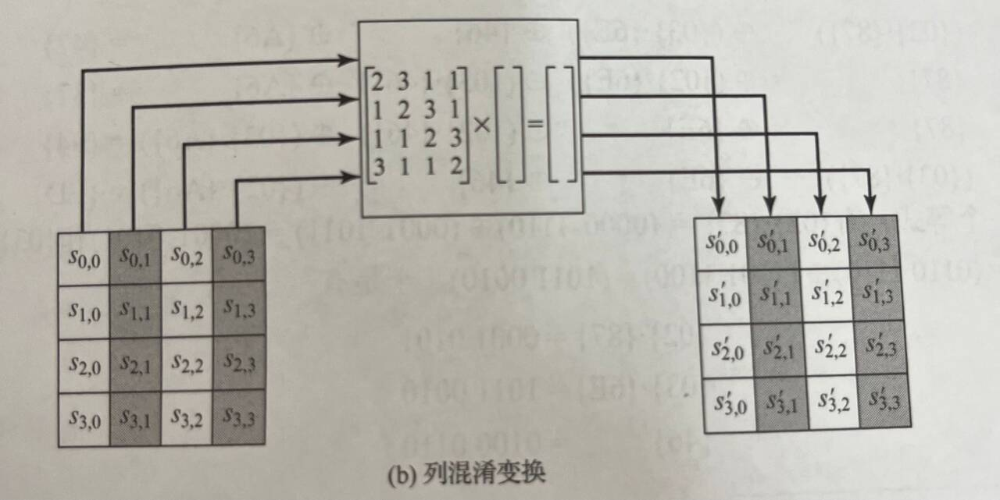
- 逆向变换：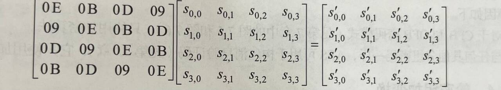
- 注意：最后一轮没有列混淆。正向变换使用小技巧可以很快得乘，因为最多乘3，而逆向变换比较麻烦：**CBC等模式只需要加密，消息验证码也只需要加密**。
###### 轮密钥加
密码加KeyAdd:将4×4的128位输入矩阵与4字轮密钥(4×4字节128位)直接异或。
##### 密钥生成
输入4个字（16字节）输出44个字（176字节）。

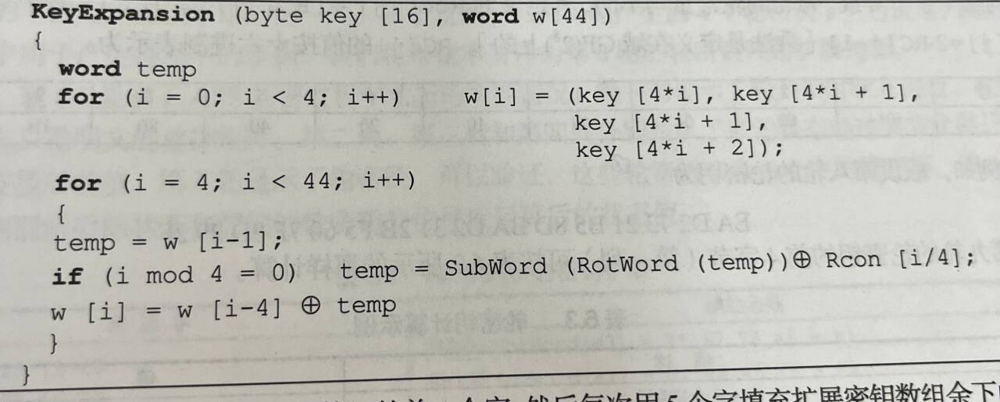
1. 首先将输入的16字节转换为4个字放入w[0..3]中
2. 接着对于每一个4字组的开头w[i](i mod 4 = 0)，选择w[i-1]经过复杂函数g处理后的值和w[i-4]异或得到结果，对于4字组的其他值w[i](i mod 4 != 0)，使用w[i-1]和w[i-4]直接异或得到结果。
3. g复杂函数：
   1. 首先进行字循环RotWord，循环左移一个字节。
   2. 接着字代替SubWord,利用S盒代替。
   3. 最后与轮常量Rcon[j]进行异或运算；
   - 轮常量：是一个字，其中最右边三字节为0，最左边的字节为RC[1] = 01,RC[2] = 2 * RC[1] = 02...
### 加密效果
- 雪崩效应：很强，明文或密钥的任何bit改变影响密文所有字节。在没有密钥时看上去完全随机。
### 算法实现
- AES加解密过程是不同的，置换ShiftRow和列混淆的混淆矩阵不同，需要不同的函数软件实现。
- 想要加解密过程一致,需要两步操作：
    1. 交换解密算法的逆字节替换和逆向Shift Row两层
    2. 交换解密算法的轮密钥加(KA)和逆向列混淆(MC)两层：$MixCol^{-1}(S \oplus Key) = MixCol_{-1}(S) \oplus MixCol_{-1}(Key)$
    3. 得到
## 分组密码分析
对于2-DES，中间人攻击复杂度$2×2^{56}$，而直接穷举时复杂度$2^{56 * 2}$，差距很大。即不同攻击方法的效率差距极大。
### 差分分析（选择明文攻击）
选择明文攻击，典型的统计分析方法。
#### 基本思想
**对某些明密文对，分析多个明文对之间的差距，统计密文对的差异，恢复某些密文**.
对于明文对$p_1p_2$，计算$\Delta p = p_1 \oplus p_2$，$\Delta f = f(p_1) \oplus f(p_2)$。分析两个差异，尝试恢复部分key。**实际上只关心$\Delta$，即明密文对的差分，不关心实际明密文对**
在DES的差6轮中，差分分析的搜索空间很大。
#### 差分过程

- 完全不安全的差分:密钥在异或运算过程中被抵消 → 直接从明文对异或值得到密文对异或值（绕过密钥）【不随机现象】
- 对于明文对差分$x_1\oplus x_2$，某一轮中$L_1$直接放入$R_2$,得到差分结果是1；$R_1$经过$L1 \oplus f(x_1) \oplus f(x_2) \oplus k_1$，当别的不变，只改变K时，以另一概率(0.25)出现另一个差分$L_2$。经过三轮DES后，从输入差分变为输出差分后概率为0.25×1×0.25。**攻击时挑选概率最大的差分对应的Key即可**。

#### 差分均匀
如果无论改变key的值，所有输出差分的概率都是一样的，那就完全安全，差分分析不可用。
### 线性分析
已知明文攻击
#### 基本思想
寻找明文、密文、密钥比特之间对高概率或低概率的**线性逼近**，尝试恢复某些密钥的比特位。
#### 分析过程
设计一个线性过程，概率逼近加密过程中的**非线性部分**。以DES为例，计算$\Delta X=linear(x) \oplus f_k(x)$，降低$\Delta X$的Hamming重量（1比特数量）。复杂度极高。
### 侧信道攻击
Side-Channel Attack，SCA
利用密码系统的物理实现中获取的物理特征进行密码分析。分析运行时间、功率消耗、电磁辐射、声音等。
### 故障攻击
Falut Attack，FA
在密码系统的物理实现中加入**干扰**，使得生成故障的密文或签名，利用故障信息进行分析。
利用密文c，故障密文c‘进行分析。
## 分组密码的工作模式
工作模式是指：增强密码算法或使**得密码算法适应实际应用的技术**。
目前定义了五种工作模式,覆盖了大部分实际应用场景。类似一种建房子的安全模式,必须按照这种方式建。
### 模式分类
1. 加密模式
   1. 存储设备加密模式：Windows的Bitlocker
   2. 格式保留加密方法：FPE，Format Preserving Encryption。例如数据库中定义的字段，加密后变混乱不能识别，且熵增可能放不下。
2. 认证加密模式
3. 认证模式
   1. 高吞吐率认证
4. 密钥封装方法
### 工作模式评估
1. 安全性能：抗攻击能力、加密保密能力
2. 实现特性：并行能力、单元复用，实现安全的效率和成本
3. 错误恢复
4. 错误传播：一bit错误翻转对密文恢复的影响
5. 扩散能力
6. 消息膨胀：填充
### 电码本模式（ECB Electronic CodeBook Mode）
用相同密钥加密明文消息的每个划分小部分。$明文分组1→^{Key} 加密分组1、明文分组2→^{Key}加密分组2....$
##### 加解密流程
报文padding为整数倍的分组长度，再分割为多个小分组，每个单独用同一个Key加密。
##### 优缺点
1. 优点：并行加密、随机存取
2. 缺点：需要明文填充，相同明文分组对应相同的密文，有统计规律，例如对一张图像加密，按顺序加密后会保留轮廓和特点。可能被重排、篡改、替换
3. 错误传播仅局限在分组内
### 密文分组链接模式CBC加密(Cipher Block Chaining)

##### 加密流程
1. 对于第一个分组，随机生成一个初始化向量IV（长度与分组大小相同），对第一个分组进行异或加密，再使用Key密钥和分组加密算法加密分组1。
2. 对于第$i$个分组($i>1$)，使用第$i-1$个分组的密文与其明文进行异或，再使用Key和分组加密算法加密。
##### 解密流程
1. 第$i$个分组使用密钥解密，解密后用第$i-1$个分组密文异或得到明文。
2. 若$i=1$，则解密后用IV异或解密。
##### 优缺点 
1. 优点：避免了明文特征重复，减弱统计特征。可用于认证。
2. 缺点：只能串行加密，吞吐量不高。但解密可以并行。仍然需要Padding。若所有明文加密都使用一个Key和一个IV,不随机选择IV，则会有问题（**考试会考哦~**）:使用相同IV导致相同明文加密的密文一样,有和电码本模式一样的问题.
   1. 相同IV导致相同的密文，导致重放攻击。
   2. 已知明文攻击：若已知明密文对，就可以从中求解IV和密钥Key的相关信息
3. 加密时，第$i$组密文的比特翻转会影响i和i后面的所有组。解密时，第$i$组密文的比特翻转仅会影响i和i+1组。适合用于**认证**，即确保完整性。
### 密码反馈模式CFB Cipher Feedback mode
将上一块的密文输出用K加密，和当前明文异或，作为当前的明文输出。
CBC Chain链式，将本块明文和上块密文异或再加密： $C_i ← E_k(P_i \oplus C_{i-1})$ 
CFB 密码反馈，将上一块密文加密，反馈（异或）到这一块的明文。$C_i ← E_k(C_{i-1}) \oplus P_i$
##### 加密流程

分组长度s bits
1. 初始随机IV(b bits)作为$I_1$，用K加密，得到了加密密钥O(b bits)，随机选择s bits的加密密钥，与明文$P_1$异或，得到密文$C_1$。
2. 存储密文$C_1$，使用移位寄存器移位得到b bits的$I_2$，重复上述过程。
##### 解密流程

1. 用IV加密生成第一组加密密钥O，选择s bits密钥后与$C_1$异或，得到第一组明文。
2. 第$i$组使用第$i-1$组的密文$C_{i-1}$加密得到O，O选择出加密密钥，与$C_i$异或得到明文$P_i$
##### 优缺点
1. 不能并行加密，可以并行解密
2. **不需要解密算法**，只需要K和IV/上一组密文的加密算法。
##### 错误传播
加密：一个密文翻转传播到当前和所有后面的分组
### 输出反馈模式OFB(Output Feedback Mode)
##### 加密流程

1. 一个随机数Nonce，与密钥K加密得到密钥$O_1$；再i加密得到$O_2,O_3,...,O_n$。只加密Nonce的输出。
2. 对于每个明文$P_i$，使用$O_i$异或得到密文$C_i$。
##### 解密流程
重新计算所有密钥$O_i$，将密文$C_i$重新异或就得到明文$P_i$
##### 优缺点
1. 如果预计算$O_i$，就可以并行加解密。
2. 没有错误扩散，但对抗主动攻击的能力很差。
##### 错误传播
加解密的翻转只影响当前组。
##### OFB和CFB区别

### 计数器模式CTR
高速并行预计算

## 分组密码对比

## 分组密码的膨胀
某些应用领域不能使用带膨胀的方案。 
### 填充问题
分组密码的最后一块大小$\leq$block size。如果使用0padding，则不知道最后一个0是填充的还是实际的。解决方法：通常以字节长度来填充。**最少padding膨胀1字节，最多padding膨胀整个blocksize字节数**
- 例如，AES有64位16字节，若只有5字节，需要补充11字节=0x0B的0。补充方法：最后11字节填充0x0b个0x0b，de-padding时，从最后一位0x0b开始扫描，扫描0x0b个，如果中途不连续则出错/有攻击...
- 如果不需要填充（长度恰好是blocksize的整数倍），则仍然要加一个padding分组，消除二义性，整一个0x0F个0x0F字节最后一组。
### 是否存在无膨胀的方案？密文挪用技术CTS:Ciphertext Stealing Technique
用于处理分组密码中，分组长度不能均匀分割的消息，不产生任何膨胀，但增加一点复杂度。
##### 处理方法
前面的分组按照正常模式处理，将最后两个明文分组的处理顺序调换，并对最后两个密文分组重排序（Reorder processing）。称为CTS-CBC/CTS-ECB。


先加密$p_{n-1}$，得到的$c_{n-1}$作为密文的$c_n$储存；再加密$p_n | c'$，得到的$c_{n}$作为$c_{n-1}$
###### 加密
1. 第$p_{n-1}$个分组正常加密得到$c_{n-1}$
2. 利用$p_n$长度$|p_n|$将$c_{n-1}$切割，前一部分$c_n$,长度为$|p_n|$，后一部分为$c'$,长度为$|c_{n-1}|-|p_n|$，则$c'$的长度正好和$p_n$需要的padding长度一致。将$c'$拼接到$p_n$后，再进行加密。存储密文时将其反过来,**可以丢弃最后一个分组的C'**，最终导致不膨胀。
3. 无论多长的数据，最终需要的额外处理就是一个常数级别的分割C'操作，所以效率很高。
###### 解密
1. 解密$C_{n-1}$得到$p_n$，解密$C_{n}$得到$p_{n-1}$
### 可调分组密码Tweakable Block Cipher 简称TBC(知道就行了，了解一下，但前面五种加解密模式要清楚)
多用于磁盘加密
输入：一个明文P、一个对称密钥K、一个调和值T（不需要保密，类似于磁盘扇区号），可以提供多变性，对相同明文产生不同的密文，**防止统计攻击**。
# 流密码
OTP：One-time pad cipher，使用一个随机的流密码$k$，加密$c←m \oplus k$。要求：
1. 这个流密码只能用一次，否则密钥k会泄露。
2. 这个流密码长度$|k| \geq |m|
最大的问题是如何进行Key Generation,找到一个KG算法，使得$k←KG(seed)$，且k满足上述要求。可以使用迭代的方式，$l←KG(KG(...KG(seed)))$
注：AES使用OFB模式时，可以做到和流密码相同的效果。
## 随机数
保密系统的保密能力还取决于随机数的质量。
多用于：
1. 会话密钥[需要加密]
2. 公钥的pq值[需要加密]
3. 挑战响应认证[不加密]
4. 防重放攻击的NONCE[不加密]
5. 口令保护的随机数值[salt,不加密]，$pwd'=Hash(pwd,salt)$
### 随机数质量要求
1. 均匀分布：0/1出现概率各半;0-255出现概率1/256...
2. 无周期，无法预测和推导,不能从一个子序列推导出另一个子序列
- 如使用无理数($\pi 、e$)等
### 真随机数
不实用，可以使用随机源(熵源),如物理方法（热运动等）或专用硬件（Intel Random Generator）产生。
生成后可能随机源存在偏差，需要使用哈希函数(Md5、Sha-1)等消除。
### 伪随机数
**统计上看上去随机(服从均匀分布且相互独立)**,周期很大，类似一个随机数.
##### 伪随机数发生器PRNG
使用一个种子(由真随机数产生器TRNG生成)作为输入,通过反馈通路生成多个随机子序列.如果得到种子和算法就可以重现整个随机序列.
1. 三大公设(了解)：01个数相差最多为1，每个长度序列（游程）的01数量相同。异相自相关系数是常数（序列和自己平移后的序列对比，找不到信息）
2. $random_y ← PRNG(seed)$，$seed$是一个短值,产生一个长度很长的$random_y$，且周期很长。
#### 伪随机数测试要求
1. 均匀性:01出现频率相同
2. 可伸缩性:测试一个序列是随机的,随机抽取的小的子序列也随机
3. 一致性:所有输入对应的生成器性质都相同
#### 伪随机数不可预测性
1. 正向不可预测:不知道种子,则无论知道多少前面的随机序列都无法预测后面的序列
2. 反向不可预测:不能通过已生成的序列预测出种子
##### 伪随机函数PRF
使用种子+上下文特定值(用户ID等)生成固定长度的伪随机位串.
#### 算法实现
##### 简单线性同余方法
###### 迭代思想
1. $X_0=seed$
2. $X_{i+1} = (aX_i+b) \mod m$，m是一个常数
###### 基本要求
- 基本要求是能够通过随机性测试、且周期为m。
- 若m为素数，则合理选择a，就可以做到周期为$m-1$(缺少一个0值)
- IBM算法：$a=7^5,m=2^{31}-1(素数)$
###### 不足
- 线性函数选定$X_0$后，就可以预测所有$X_i$。如果得到确定的$X_0、X_1，X_2,X_3$（即四个随机数）,就可以解出$a、m、c$.
- 如果已知$a,m,c$,则知道任何一个随机序列就可以预测后续所有序列
###### BBS PRNG
仍旧同余，但使用乘法（平方）运算，选取的n特别大。
1. $x_0=seed^2 \mod N,n=pq,p或q = 4k+3$，即$pq$在模4下同余3,且$p,q$是两个大素数,$s$与$n$互素
2. $x_i=x_{i-1}^2 \mod n$
3. 取$x_i$最低比特位进行输出。
- 预测复杂度类似于离散对数问题。
- 运算效率慢（因为n非常大）
###### 基于分组密码的PRNG构造
使用安全的分组密码如CTR、OFB模式进行构造。
选定一个seed的K，返回轮询加密比特1
> NIST CTR_DRBG
> 使用CTR模式加密.有K密钥,V待加密信息.
>> 1. 初始化:初始设置K,V为某个初始值.使用CTR加密,直到生成足够大(seedlen)的分组,取前seedlen位,与熵源生成的随机数异或得到$(K,V)$
>> 2. 使用$K,V$作为密钥加密CTR,每次加密后CTR+1,并有一个生成分组个数,达到reseed_interval后自动调用更新函数重新获得新的$K,V$
###### 基于移位反馈寄存器的方式
是一种重要的钟控单元。
一个固定长度的队列，按照某种规则和时钟节拍（钟控信号）来进行移位，并进行出列（输出）和补列（状态更新）。
- 组成:由一堆一位存储单元$B_nB_{n-1}...B{0}$组成,对应了本原(生成)多项式的系数$A_0=1A_1...A_{n}$,是倒序的,每个机器时钟周期取出最低位,右移并通过整体状态计算出新的$B_n$
- 多项式设定:$A_1A_2...A_n$的取值决定了是否增加异或组件,若为1则在对应$B_i$下增加异或组件,表示了一个首一的本原多项式.只有本原多项式才能满足周期为$n$.一个NLSR的周期为$N=2^n$,就说明生成的随机序列为m序列或最大长度序列.
- 生成序列:对使用特征多项式取倒数,得到的循环商就是生成的序列.
- 安全性:一般不用于生成流密钥,否则1.初始寄存器中直接包含了密钥2.只要攻击者获取2n个循环序列就能确定整个多项式.
- 
## 流密码
短密钥生成伪随机流密钥,异或加密明文.
### 流密码要求
有状态$s$,状态转换函数$f$和流密钥生成函数$g$
要求:
1. 加密序列周期长
2. 密钥流接近真实随机
3. 密钥足够长(类似分组密码要求)
### RC4 
一个状态数组S,输入一个0-255字节密钥.
- ```Python
  def RC4_gen_key(key, require_length):
      # 初始化
      key_len = len(key)
      S = [0] * 256
      T = [0] * 256
      for i in range(256):
          S[i] = i
          T[i] = ord(key[i % key_len])
      j = 0
      for i in range(256):
          j = (j + S[i] + T[i]) % 256
          S[i], S[j] = S[j], S[i]

      # 流生成
      i,j = 0,0
      result = []
      for count in range(require_length):
          i = (i + 1) % 256
          j = (j + S[i]) % 256
          S[i], S[j] = S[j], S[i]
          t = (S[i] + S[j] ) % 256
          result.append(chr(S[t]))

      return result
  ```


# 哈希函数
使用的是**密码**哈希函数，比一般数据结构的哈希函数要求严格得多。
## Hash函数性质
使用Hash函数，有时也称为消息摘要Message Digest、数字指纹Digital Fingerprint。生成相同长度的摘要输出。**输入长度可变而输出长度相同**，一般128/160比特，效率高。表征该数据特征。**多个输入可能对应同一个输出，但同一个输入一定对应同一个输出**。
### 散列函数的要求
$h = H(x)$,$h$称为原像.满足1-5称为弱哈希函数,1-6称为强哈希函数
1. 输入长度可变
2. 输出长度固定
3. 正向计算效率高
4. 单向性（抗原像攻击）：快速计算出H(M)，但构造逆函数$H^-1(M)$不可行，**求逆困难**。  
5. 弱抗碰撞(抗第二原像攻击)：给定M，计算上给不出M'，使H(M)=H(M')；
6. 强抗碰撞：找不出任何一对M,M'，使H(M)=H(M')
7. 改变消息的任何一位，会导致Hash结果大部分改变。满足伪随机性测试的条件。
- **如果满足强抗碰撞则一定满足弱,但不一定满足单向性**
- **抗碰撞的强度是长度一半**(128位散列值抗64位冲突，$2^{64}$次操作后才冲突);抗原像(逆函数)平均需要遍历127位.
### 为什么128位抗64位的强弱碰撞冲突?生日攻击。
利用概率学的经典问题：教室中的所有人，存在有相同生日的两个人，概率超过一半只需要23人。在$(0)-(N-1)$的均匀分布中随机挑选,则$\sqrt(N)$次后出现重复的概率大于0.5
即存在碰撞的概率大.
具体过程:
1. 首先对应受害者想要发送的m长度信息x,生成$2 ^ {\frac{m}{2}}$个含义相同的信息x'(使用加空格和退格字符,改变语序等方式)
2. 敌手把想要修改的有害信息y生成含义相同的$y'$,计算H(y')是否等于H(x'),直到找到.平均遍历$2 ^ {\frac{m}{2}}$次.
3. 将x'y'发送给受害者A用对称密钥K签名,将x'替换为y'发送
### 密码分析攻击哈希函数
使用迭代结构产生的哈希函数,需要将分组长度加入压缩函数中,这样才能保证抗碰撞
## 目前有的函数
CRC:很难检测出流的比特改变、奇偶校验码：只能检测出奇数个错误，不满足单向性等性质。
MD2/MD5：已经不使用，被差分分析后强抗碰撞被攻破。
SHA/SHA-1：不使用
SHA-256/SHA3...
## 安全哈希算法SHA
基于MD4.SHA-1有160位的哈希值;SHA-256,SHA-384,SHA-512
### SHA-512结构
输出512位消息摘要,1024位分组
1. 总分组长度填充100000...到$896 \mod 1024$,加上最后128位无符号整数表示总长度.
2. 初始化哈希缓冲区8个64位寄存器,是前8个素数的平方根取前64个小数组成的,共512位作为初始向量IV
3. 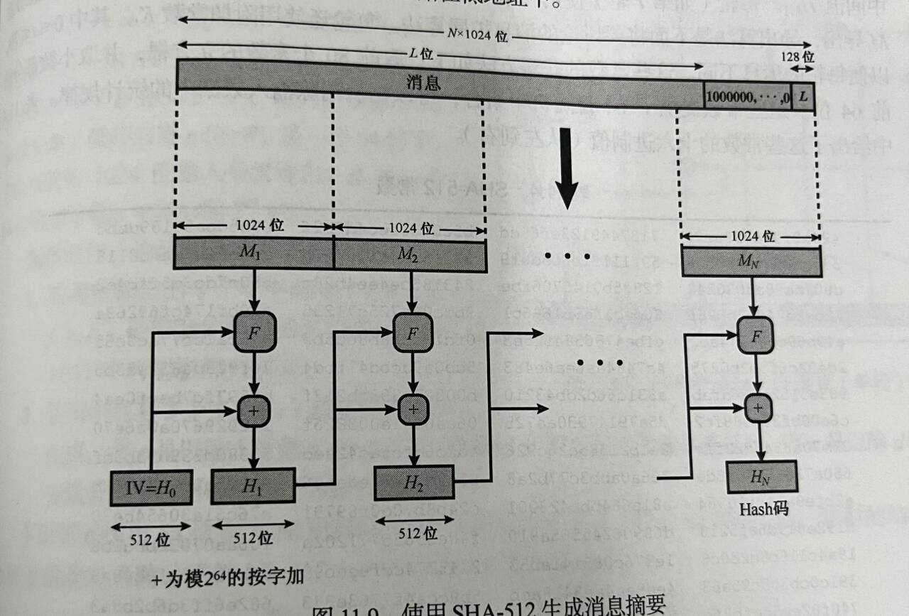
4. F函数是个80轮函数如下: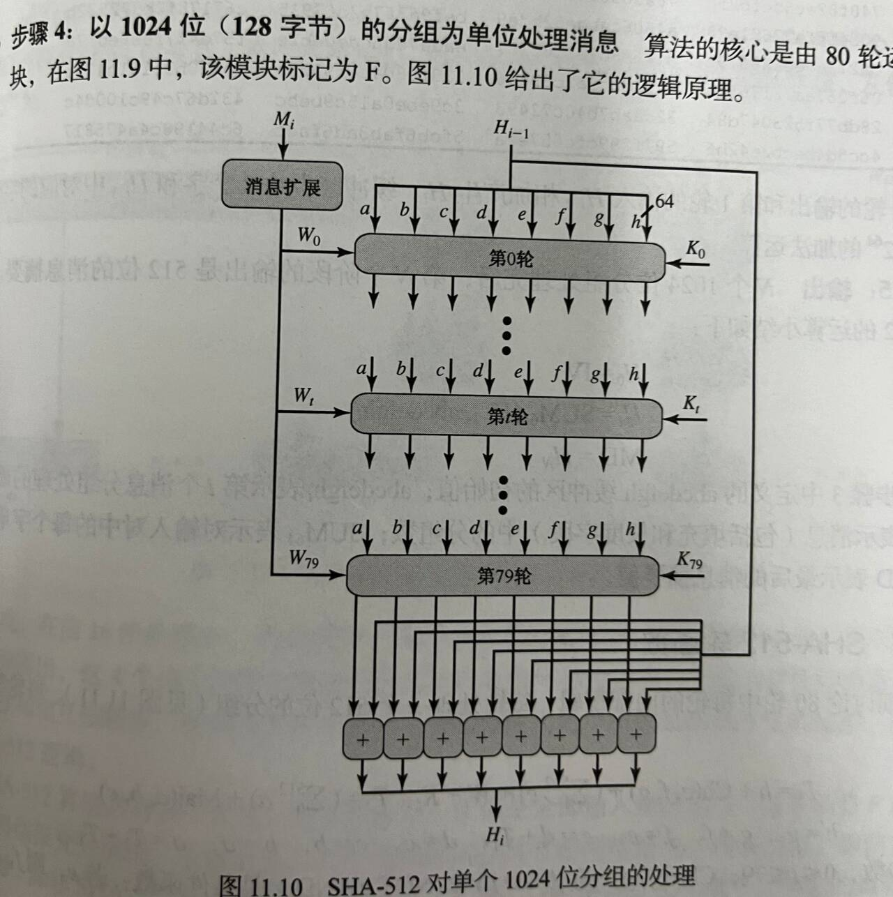
   1. 有一个消息扩展算法,将1024位分组生成为80个64位分组
   2. 取80个常数(前80个素数的平方根前64位)$K_t$
   3. 每次更新缓冲区内容
   4. 最后将缓冲区内容和上一组输出做模$2^{64}$相加
### SHA-512特点
每一位都是全部输入位的函数,进入F压缩函数后被充分混淆
### SHA-3
海绵结构,类似上面的结构.将明文划分为多个定长分组后加入哈希函数,且上一组的哈希输出反馈到下一组的输入.
看书吧
### 安全哈希函数SHA结构
Secure Hash Algorith:SHA
MD2、MD5、SHA、SHA-1、SHA-256等使用使用结构
#### 基本结构

功能：将定长的抗碰撞Hash函数转换为变长的抗碰撞Hash函数。
1. 设计一个压缩函数h，要求效率高、抗碰撞、较小等
2. 将消息分块并padding，并增加一块表示padding长度和消息长度等。
3. 经过SHA精心设计的多轮Hash，得到最终Hash结果。
- 注意：**IV可以重用**，是一个常量。
- 和分组加密的方式有本质不同，且效率比分组加密的Hash高。
#### MD5

## 作用
### 生成单向口令文件
如在操作系统中存储口令的Hash值摘要。password:pw=Hash(pw)。
安全要求：q次尝试中从Hash(pw)中恢复pw的难度和q次内直接尝试找到pw的难度一样大。 
为了确保短密码的抗冲突性，可以加入随机数盐值salt，计算Hash(salt,Password,salt)。不一定保密但是需要随机。
### 存储云端文件
# 消息认证
确认消息完整性,**防止篡改**。 


使用对称密钥的消息认证码
- 2方法在不需要保密时更加快捷,使用消息认证码MAC算法,是一种带密钥的哈希函数,往往使用更高效的专用MAC算法.
## 消息认证码MAC
Message Authentication Code:MAC，可用于认证消息完整性，生成一个Hash值。
1. HMAC：带有密钥的MAC码。
2. CMAC：利用DES-CBC，增加两个密钥，便于处理变长数据
3. 数据认证算法DAA：目前已停用。基于DES与CBC。看看就得了。
### 作用
1. 消息完整,未被篡改
2. 身份认证
3. 如果明文有序号等内容,则可以确保顺序
### 和加密不同
1. MAC不要求逆向解密
2. MAC是多对一函数
3. MAC更不易被攻破
### 安全性
1. 可以提供认证,且若需要保密则可以在加密前或加密后对消息进行MAC认证,而普通hash算法必须在加密之前.**但总体来说将MAC直接附在明文后好一些**.
2. 对MAC函数的要求:
   1. 抗弱碰撞:给定M和MAC(K,M),找出M'使得MAC一致在计算上不行
   2. 抗强碰撞:找到一对M和M'概率为$2^{-n}$
   3. 每个分组强度一致:翻转某些分组位得到的M'和原M相同的概率都是$2^{-n}$
3. 对MAC进行穷举攻击的消耗是$min(2^k,2^n)$,其中$k$是密钥长度,$n$是MAC长度
### HMAC
要求直接用现成的Hash算法,且嵌入简单,密钥生成简单
##### 普通HMAC

1. n是生成的MAC长度
2. b是分组长度
3. 密钥K,长度建议大于n.若大于n则放入哈希函数输入后变为b.不满b则在最左侧padding0到n;
4. ipad(36)和opad(5C)是重复8位数得到的,共b位,和密钥异或后拼接在分组最前面.异或两个值是为了获取各一半的密钥信息进行两次Hash.
5. IV是初始向量
##### 优化HMAC
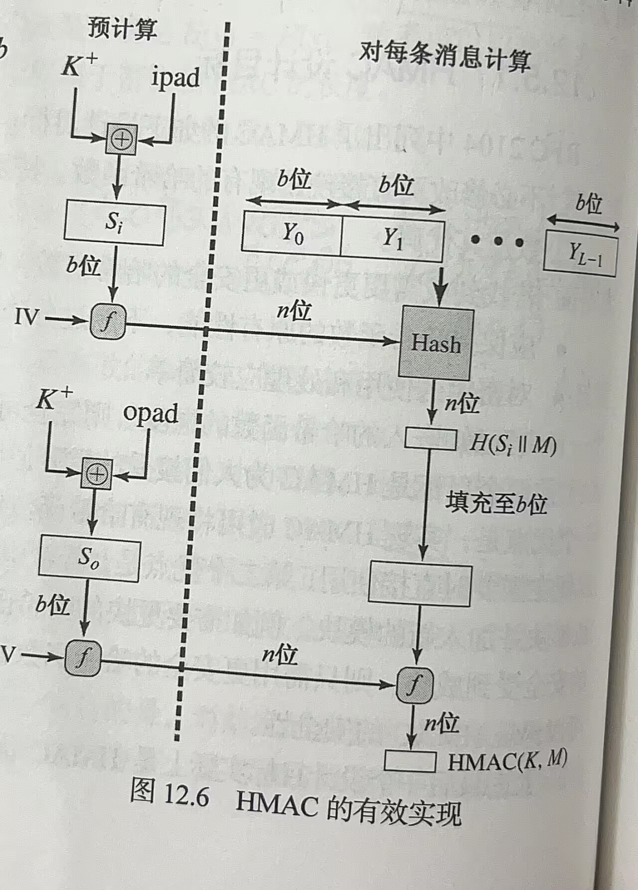
预计算$S_i,S_o$和IV初始向量进入f压缩函数后的值.
##### HMAC安全性
依赖于哈希组件安全性。可能攻击算法本身或Hash函数。 
当注重连接速度时,使用MD5仍然安全.
### 基于分组加密算法CBC-MAC(CMAC)
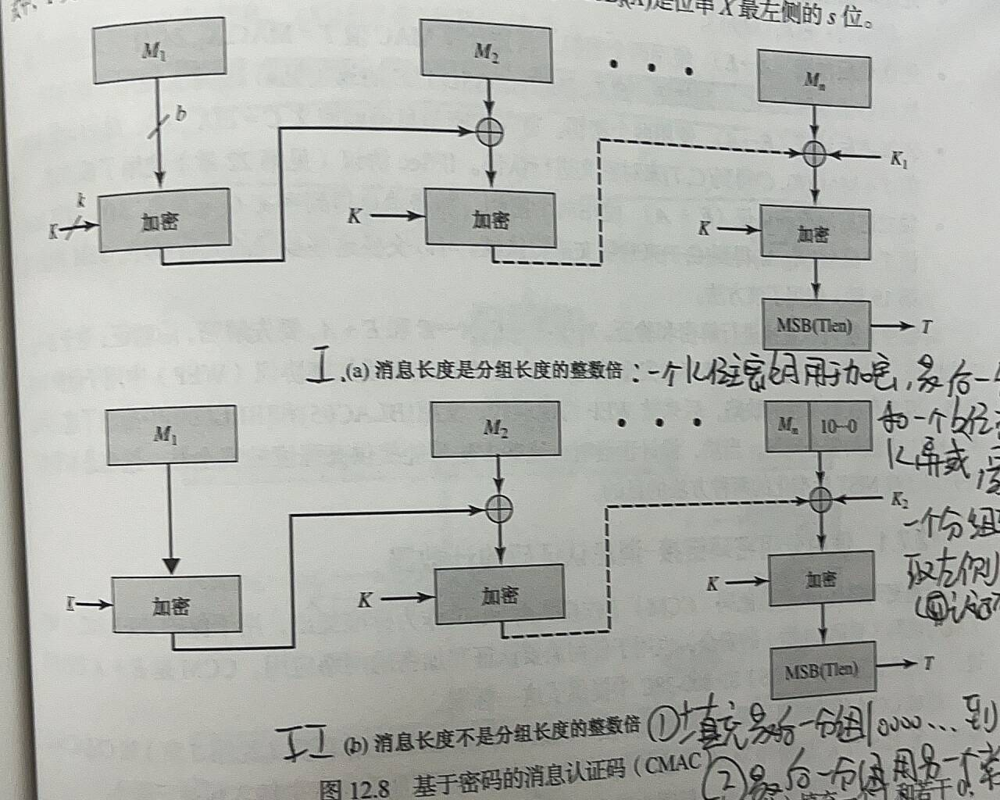
使用DES/AES的CBC模式进行MAC生成.密钥,分组长度等取决于使用的密钥.在分组时需要padding,增加10000...直到最后一个分组padding满.
1. 若不需要padding,则多个分组采用cbc模式加密,第一个分组的IV为0,最后一个分组异或一个常数$k_1$,取最后一个加密结果的前t位,t取决于需要多少位的MAC.
2. 若需要padding,则最后一个分组异或常数$k_2$
3. 常数$k_1,k_2$是在$GF(2^b)$下的.$L=E(K,0分组),k_1=L·x,k_2=L·x^2$,其中$x,x^2$是多项式.
##### 安全性
分组密码需要padding，在padding数据中加入padding长度和原信息长度。padding后使用CBC模式加密即可。
###### 穷举攻击
如果输出n比特的Hash值，则：
1. 抗原像攻击（单向性）：$2^n$，需要全部遍历
2. 抗第二原像攻击（弱碰撞）：$2^n$
3. 抗强碰撞攻击：$2^{\frac{1}{2}}$  
## 和加密（数据机密性）的不同
##### 被动敌手：加密
对于一个敌手Adversary，想要窃听和分析。加密的目的是**抗消息窃取**和**一定程度的流量分析**。
加密不能完全隐藏，知道在通信，但不知道具体协议和通信内容。仍然可以通过如数据流量大小communication size等猜测（可以使用不同加密模式处理，但仍然难以解决；流密码长度易被侦测）。这就称为leaking。
##### 主动敌手：认证
对于一个敌手，可能还会伪造、篡改、重放、拒绝服务攻击。这破坏了**数据完整性**。需要Hash函数。
## 应用实例（了解）
##### CCM消息认证
基于Counter和AES。首先将数据和nonce头拼接，分块后进行CMAC。之后加密

##### GCM
可以做多线程的优化。

### 后面就快速过一下
#### 密钥封装
KW Key Wrap
使用AES或3DES作为加密基础，使用预共享的对称密钥交换其他对称密钥，有鲁棒性
#### 使用哈希函数或MAC生成伪随机函数
例如使用一个计数器，一直向Hash函数中输入，输出随机数；
或使用HMAC，一个Key+计数器。
# 公钥加密
从古典密码到DES，都是使用了替换和置换等方法。使用对称密码交换密钥时可能用到KDC,KDC要是不诚实可能泄露密钥;且需要一个方法来实现数字签名.
而Diffle-Hellman提出了公钥思想D-H交换。可以实现加密、认证。
## 思路
对称密钥难以协商，且需要过多密钥；可以通过算法得到一对公私钥对$P_k,S_k$（是两个大数），要求不能通过$P_k$恢复出$S_k$。实际上计算量过大难以实施。目前使用的是**混合加密模式**，并不是说对称加密模式不好。
## 用处
### 保密
a发送m明文：$Enc(pkb,m)=c$，b解密$Dec(c,skb)=m$
### 数字签名
a发送m明文：$Sign(ska,m)=\sigma$、$Verify(pka,m,\sigma)$。进行签名后，只有拥有私钥$ska$的才能加密，所以认证了身份。
#### 安全性
攻击者可以尝试恢复私钥，或通过得到的多个$\sigma$进行伪造一个新的$\sigma ^ *$
### 同时保密和签名
用$pkb、ska$进行签名和加密。
## 构造公钥体系
Diffle-Hellman说,公钥密码需要满足:
1. 生成公私钥容易
2. 加公钥密$m$容易
3. 私钥解密$c$容易
4. 已知公钥$PU$而求解出私钥$PR$不可能
5. 已知公钥$PU$和密文c不可能恢复明文
6. 两个密钥可以交换,即公私钥只需要保密一个
- 容易指的是在输入长度的多项式时间内完成
- 要求密钥足够长来抵抗穷举,但加解密速度会变慢.
### 单向函数
#### One-way Function生成密钥对
目的：一个函数，得到$H=f(x)$很容易，而逆函数$x=f^{-1}(H)$计算很难。这个函数就是使用公钥进行加密。
#### 单向陷门函数
如果得到了某个陷门（秘诀），则x恢复很容易。这个陷门就是私钥。
#### RSA：整数分解假设
##### 整数分解实现
定义一个PPT算法GenModulus($1^n$)，输入n，输出一个N=pq（pq为素数）。
定义实验：
给定n、算法GenModulus。
1. 生成(N,p,q)。
2. 敌手选择p'q'=N
3. 判断p'=p,q'=q，则输出1，否则输出0。
大整数分解难度在于：敌手获胜的概率小到可以忽略。
##### RSA假设
定义一个PPT算法GenRSA（$1^n$）=(N,e,d)，N为两个n比特素数p、q的乘积。$gcd(e,\Phi(n))=1$且$ed = 1 mod \Phi(N)$
定义实验：
给定敌手A和安全参数n。
1. 生成$(N,e,d)$
2. 均匀随机选择$y(y \in Z^*(N))$
3. 敌手A给定一个$N,e,y$，输出一个$x$；
4. 若$x^e = y mod N$，则输出1，否则输出0
###### 如何构造GenRSA
1, (N,p,q) ← GenModulus(1^n)
1. $\Phi(N) =（p-1）（q-1）$
2. 选择一个e，使得$e \equiv 1 (mod \phi(n))$
3. 计算d 
返回(N,e,d)
#### 离散对数假设Elamal
一个循环群生成算法：$g(1^n) → (G,q,g)$G是一个循环群、q是阶数、g是生成元。
### Diffle-Hellman密钥交换协议
不抵抗中间人攻击
ab双方共享g、q两数。
1. a生成一个$x_a$数字，b生成一个$x_b$数字。
2. a发送$g^a mod q$,b发送$g_b mod q$
3. 最终使用$g^ab mod p$进行通信
## RSA
**基于RSA假设，而不是大整数分解假设**。RSA假设是大整数分解假设的变体。
是一种分组密码，通常明文和密文都在0至n-1之间，其中n是1024位二进制数。
### 密钥生成流程
1. 选取两个512bit素数p、q
2. 计算N=pq
3. 计算$\Phi(N) = (p-1)(q-1)$
4. 选择公钥e，要求与$\Phi(N)$互素，$gcd(e,\phi(N))=1$
5. 计算私钥d，使得$de \mod \Phi(N) =  1$；在$mod N$下求$e$的乘法逆，使用拓展欧几里得。
6. 发布公钥$(e,N)$，私钥保密$(d,N)$
### RSA加解密
1. 加密$c=m^e \mod N$
2. 解密:$m = c^d \mod N = m^{ed} \mod N$
加解密时可以使用中国剩余定理加速。
### RSA要求
##### 加解密陷门要求
找到一个$e$、$d$、$n$，使得对于所有$m<n$，有$m^{ed} \mod n = m$
- **当$e、d$两个数为$\mod \phi(n)$下的乘法逆元，且$e、d$与$\phi(n)$互素时可以满足这个要求**。原因：
  1. 如果$e、d$在$\mod \phi(n)下$互为乘法逆，则有$ed \mod \phi(n) = 1$，则有$ed - 1 = k\phi(n)$
  2. 欧拉函数性质：如果$m、n$互素，则$m^{\phi(n)} \mod n = 1$。这样，如果$m、n$互素，就有$m^{ed} \mod n = m^{k\phi(n)+1} \mod n = m · m^{k\phi(n)} \mod n = m \mod n ·(m^{\phi(n)})^k \mod n = m · (1) ^ k = m$
  3. 如果$m、n$不互素，则一定有$m = kp$或$m = kq$，则
     1. 由于$ed \mod \phi(n) = ed \mod (p-1)(q-1) = 1$，所以$ed \mod (p-1) = ed \mod (q-1) = 1$(如果两个数在模一个较大的数下同余，那么它们在该较大数的任何因子下也同余)。根据费马小定理，有$m^{ed} \mod p = m$、$m^{ed} \mod q = m$
     2. 根据中国剩余定理，有$m^{ed} \mod pq = m$，即$m^{ed} \mod n = m$
### RSA的计算问题
RSA都是指数运算，计算困难。
##### 模n下的幂运算
1. 计算$a×b \mod n$可以先计算$(a \mod n × b \mod n)\mod n$。
2. 计算幂运算如$x^{16}$，可以算$x^2 = x × x$、$x^4 = x^2 × x^2$、$x^8 = x^4 × x^4$、$x^16=x^8 × x^8$。
##### 公钥计算问题
- 公钥选择太小如$e=3$,则若有三个人$n_1,n_2,n_3$,使用它们的公钥加密信息M,得到$M^3 \mod n_1/n_2/n_3$,敌手可以通过中国剩余定理计算得到$M ^ 3 \mod n_1n_2n_3$,由于$M<n_1/n_2/n_3$,所以求解立方根即可,会被攻击,解决方法:加入伪随机位串.
- 如果提前选定$e$,则选$p,q$时可能不满足$gcd(e,\phi(n))=1$,需要重新选取新的$p,q$
##### pq随机生成问题
pq是大素数且可选范围很大,选取方法:
1. 选择一个随机奇数$n$
2. 选择一个$a<n$
3. 使用Miller-Rabin等算法求判断$n$是否是一个素数
4. 若n通过足够多次则接受
- 数学上证明:在数字N附近平均每隔$ln(N)$个数就会有一个素数.也就是说素性测试中,**平均只需要找$ln(N) / 2$个数**(偶数被立即判断为不是素数).
##### 使用CRT中国剩余定理加速RSA私钥解密
###### 分解指数
对于公钥加密后的$c = m ^ e \mod n$，使用私钥求解 $c ^ d \mod n$
- $n = p × q$，$pq$互素，则$n$被分解为两个互素的数相乘的形式，这样就可以将模大数的运算转换为模小数的运算。
- 根据**费马小定理**有$c ^ {p-1} \mod p = 1$、$c ^ {q-1} \mod q = 1$。
- 计算$dp = d \mod (p-1) = d - k(p-1),dq = d \mod (q-1) = d - k(q-1)$
- 则$c ^ d \mod p= c^d × (c^{p-1})^k \mod p=c ^ {d - k(p-1)} \mod p = c^{dp} \mod p$。且同理，$c ^ d \mod q = c ^ dq \mod q$。这样就将模n转换为了二元组模$pq$，而且还将难以计算的$c^d$转换为更小的$c ^ {d \mod (p-1)或(q-1)}$；而对于原来的m明文计算，可以求解关于$m$的同余方程组$m \equiv c ^ {dp} \ mod p、m \equiv c ^ {dq} \mod q$。
- 计算m的方法：
  1. 计算辅助变量$h = q^{-1} \mod p × (c^{dp} \mod p - c ^ {dq} \ mod q)\mod p$ 
  2. 计算$m' = c ^ {dq} \mod q + hq = c ^ {dq} \mod q + (q \mod ??? × q^{-1} \mod p)×(c ^ {dp} \mod p - c ^ {dq} \mod q )$
  3. 对于这个$m'$，在???为$\mod p$情况下，$ q × q^{-1} \mod p = 1$，则可以得到$m' \equiv c ^ {dp} (\mod p)$；在???为$\mod q$情况下，$q \mod q = 0$，则$m' \equiv c ^ {dq} (\mod q)$，根据中国剩余定理中对同余方程组的唯一性性质，有$m'=m$，成功求解。
###### 直接分解$c^d$
在我们密码学实验中的CRT方法并没有分解指数，保存$dp和dq$，而是**直接将$c^d \mod n$分解为二元组$c ^ d \mod p$和$c^d \mod q$**,用同样的方法求解中间变量$h = q^{-1} \mod p × (c^{d} \mod p - c ^ {d} \ mod q)\mod p$ ，并最终计算$m = c ^ q \mod q + hq$。
- 和分解指数相比，需要保存的私钥内容更少，但指数$c^d$求解比较麻烦，速度比不上$c ^ {d \mod p-1}$和$c ^ {d \mod q-1}$。
### RSA攻击
#### 穷举
1. 枚举所有可能明文m，用公钥加密，与c对比。
2. 枚举所有可能的私钥d（已知明文）
#### 数学方法
1. 分解N=pq(多研究这个):随着计算能力提升,以及更多如特殊数域筛等算法的出现导致RSA的数字分解变得更容易.
   - 要求RSA的pq相差位数不能太大;(p-1),(q-1)都需要至少包含一个大素因子;且gcd(p-1,q-1)需要足够小. 
2. 直接求$\Phi(N)$，再求私钥d
3. 直接尝试求解d
##### 猜测随机数pq
1. 产生pq时一定要**不可预测**，密码上要足够安全。
2. 若$e<n$且$d < n^{\frac{1}{4}}$，则$d$很容易被猜测出来:Wiener攻击,连分数逼近的方法有效地(多项式时间内)恢复出私钥$d$
##### pq之间关系
1. p,q相差位数要小:保证n足够大,且防止较小的素数被快速试除. 
2. |p-q|一定要大(神奇的yafu的费马分解法)：
    1. 假设$n = a^2 - b^2 = (a + b)(a - b) = pq$,则$p = (a - b),q = (a + b)$
    2. 解方程可以得到$a = \frac{p+q}{2},b = \frac{p-q}{2}$
    3. 初始化$a > \sqrt{n}$,从根号$n$开始遍历,计算$b^2 = a ^ 2 - n$,由于$p-q$很小,所以能很快遍历出一个完全平方数$b$,此时就能解出$n$
3. 然而,|p-q|也不能太大:有Pollard_rho分解,上课没讲.
4. p-1、q-1需要有大素因子，否则有重复加密攻击
#### 实际攻击
##### 共模攻击
如果每个用户都使用同一个模数n，仅仅改变公钥e的取值(不同公钥e都是互质的)，则存在共模攻击。使用中国剩余定理计算出明文。
- 原理:贝祖定理,若$e_1,e_2$互质,则有$se_1 + te_2 = 1$
- 计算出$s,t$,若$s,t>0$则计算$c_1^s \mod n$,$<0$则计算$(c_1 ^ {-1} \mod n)^{-s} \mod n$($-s$是个正数),将新的$c_1,c_2$相乘就得到了明文$m$
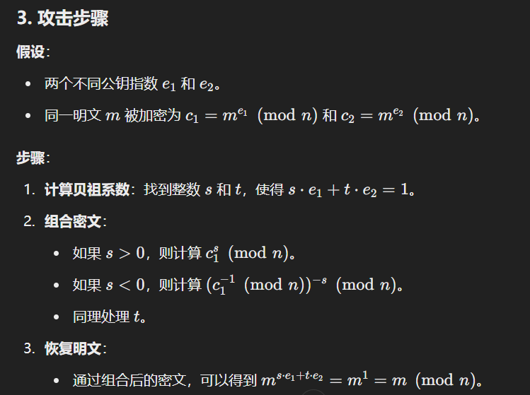
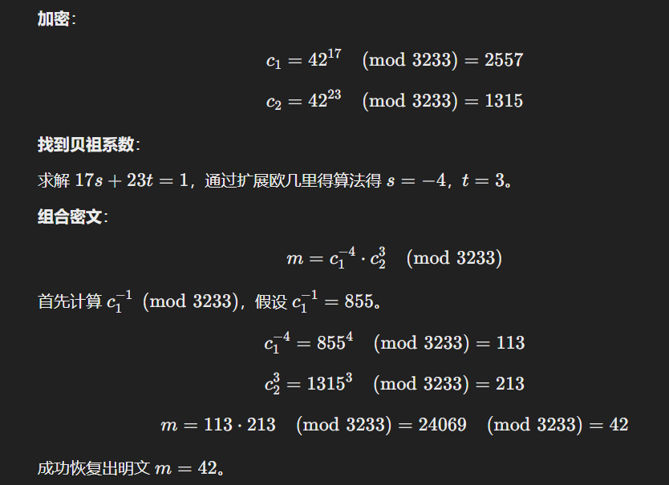
##### 低指数攻击
选取的e指数小，可以通过中国剩余定理计算。
##### 同态特性
因为$c_1=m_1^e mod N$、$c_2=m_2^e  mod N$。则$c_1 × c_2 = Enc(m_1 × m_2)$,即密文可以直接相乘,具有**乘法同态特性**
可以让云计算服务器直接计算密文，而服务器不知道具体数据，返回后仍然可以解密出正确计算结果。
为了防止攻击，可以在RSA加密时填充随机数。
###### 最优对称填充OAEP
RSA本身对于相同明文$m_1、m_2$加密的密文相同，可能存在统计分析等问题。
加入最优对称填充，增加某些随机性。
##### 计时攻击
### RSA作用
###### 加解密
###### 做认证
###### 传递会话密钥
RSA加密速度太慢，还是对称密钥好。
## Diffie-Hellman
仅用于交换对称密钥.利用了离散对数困难性.
### 交换方式
A,B两个人共享保留$\alpha,q$,$\alpha$是$q$的本原根.
1. A的私钥是$X_A$,A的公钥是$Y_A = \alpha^{X_A}$
2. B的私钥是$X_B$,B的公钥是$Y_B = \alpha^{X_B}$
3. 双方发送公钥,将对方公钥与自己私钥相乘得到$K = \alpha ^ {X_AX_B}$
### DH方法的安全性
敌手必须通过计算离散对数$X_B = dlog_{\alpha,p}(Y_B)$或$X_A = dlog_{\alpha,p}(Y_A)$
密钥交换可以通过一个密钥交换中心保存所有n个人的公钥,需要通信时取出并通信.不可以抵抗重放攻击和中间人攻击(中间人将自己的公钥分别发给AB).
## ElGamal
基于离散对数假设,非常类似于Diffie-Hellman.
构造一个循环群。
### 密钥生成
##### 发布公钥
A选定一个大素数$q$,并选择一个$q$的本原根$\alpha$
1. 选择自己的私钥$X_A < q$
2. 计算公钥$Y_A = \alpha ^ {X_A} \mod q$
3. 发布私钥$(\alpha,q,Y_A)$
##### 利用公钥加密信息
B获取A的公钥$(\alpha,q,Y_A)$.对于要发送的$m$分组后对每个组都:
1. 计算密钥K:选择一个数$k$并计算密钥$K = (Y_A) ^ k \mod q$
2. 计算公钥:$c_1 = \alpha ^ k \mod q$
3. 计算密文:$c_2 = Km \mod q$
4. 发布$(c_1,c_2)$
##### 解密信息
A获得了B发送的$c_1 = \alpha ^ k \mod q,c_2 = KM \mod q$
1. 算出密钥$K = (c_1) ^ {X_A} \mod q$
2. 求出$K$在$q$下的逆元$K^{-1}$
3. 计算明文$c_2 × K^{-1} \mod q = m K K^{-1} = m$
### 安全性
概率性的算法，概率多项式时间的算法，引入了随机性（随机选取$k$）。
- 为什么是安全的？因为离散对数假设.
- 如果使用同一个$k$加密所有分组m,那么就可能会被敌手解密:
  1. $c_1 = km_1,c_2 = km_2(\mod q)$
  2. $\frac{c_1}{c_2} = \frac{m_1}{m_2}$
  3. 只要敌手知道一个$m_1$就能轻松解出$m_2$
### 效率和优势
1. m要编码为群G上的元素。
2. 一个密文会扩张为两倍大小(c1,c2)
3. 参数g、q、g等重复使用是可以的
## 椭圆曲线
使用较小的密钥长度达到较高的计算难度。方程式和椭圆求周长类似。
基于ECDLP：椭圆曲线EC上的离散对数DLP问题。
### EC
##### 基础式子
$y^2 + axy + by = x^3 + cx^2 + dx + e$
其中abcde是满足条件的实数。
定义一个O点（无穷远点）
##### 化简式子
一般将上式化简为：$y^2 = x^3 +ax +b \mod p$(一个素域)。不用记通常会给。要求$4a^3 + 27b^2 \neq 0$
##### 曲线加减法
曲线关于x轴对称
www.desmos.com
1. 加法：椭圆上两个点$P(x_1,x_2)Q(x_3,x_4)$，P+Q表示PQ两点连线在椭圆曲线上的交点与x轴的对称点坐标。
2. 乘法：
   1. 如2A=A+A，则PQ两点无限接近与A，就是A在曲线上的**切线**在曲线上的另一个交点关于x轴的对称点。3A就是先求2A所在交点，用这个焦点再和A连线。
   2. kA很难计算。如果没有一步一步生成的连线，则很难算出曲线上的某一点E是A的多少倍。**是椭圆曲线密码的数学困难问题**。
3. 计算焦点方法：
   1. 对于PQ两点，知道PQ、且焦点x在椭圆上，则y的值可以通过计算Px、Qx之间斜率相等的方程求出来。x值可以通过带入y求出来。
   2. 
   3. 
### 在$Z_p$下的素数曲线
所有变量和系数都是在$\mod p$运算下的.仅对所有的$(0,0)-(p-1,p-1)$点感兴趣.要求$4a^3 + 27b^2 \mod p \neq 0$
- 是一个有限交换群
- 负元:对于$P(x_p,y_p)$,负元式$P'(x_p,-y_p)$,例如模23下$P(13,7)$的负元式$P'(13,-7) = P'(13,16)$
### 密钥交换(D-H方法)
对于$y^2 = x^3 +ax +b mod p$，选择素数p（大小约为160+比特），a、b
1. 选择一个生成点$G(x_1,y_1)$。公开a、b、G
2. A选择秘密$N_a$，计算$P_a=N_a × G$
3. B选择秘密$N_b$，计算$P_b=N_b × G$，这个过程就像是将一个在某个位置的足球踢若干脚，但攻击者不知道。
4. 交换$P_a、P_b$。计算K=$N_a × N_b × G$,K'=$N_b × N_a × G$。类似一个DH交换。
### 加解密方案

原理：先通过$P_m+k×P_b$掩盖$P_m$，在通过$k×G$掩盖$k$。只要知道陷门$N_b$就可以解密。
- 首先将明文$m$转换为椭圆曲线上的点$P_m$.
1. 每个人都要选取自己的私钥$n_A$和公钥$P_A = n_A × G$,其中要共享参数$a,b$和基本点$G$,若是$Z_p$下的还要共享$p$
2. 发送密文:A向B发送密文,则随机选取一个秘密k,这个k就用来混淆明文m,计算$c_m=\{c_1 = kG,c_2 = P_m + kP_B\}$
3. 解密密文:B获得了$c_m$后,计算$c_2 - n_b×c_1 = P_m + kn_bG - n_bkG = P_m$,就回到了m
### 效率速度 
密钥长度相等，RSA和ECC加密速度一样
但为了达到相同安全性，ECC可以选择更短的参数,基于椭圆曲线对数问题.
## 总结
公钥更灵活适用于更多场景，但达到相同安全要求下，效率比对称更低。多用混合加密的方式。
# 数字签名
## 概述
### 对称/非对称加密做认证的区别

### 数字签名概述
用于抗抵赖且表明身份。
对于对称密码进行认证算法，如HMAC，虽然可以确定key相同认证完整性，但可能存在中间人攻击，共享的对称密钥k可能是发送方接收方AB共享的，也可能是AB与中间人相互共享的，**不存在身份认证功能**。
- 为什么抗抵赖？公钥文件由CA证书授权机构分发，而CA是可信的。是一种基于可信第三方的认证方式。**一种信任转移，有可转移性**
- 直接数字签名:只涉及发送接收双方的数字签名,可能会抵赖(如声称自己的私钥被盗取),需要加上时间戳等内容
##### 数字签名一般模型
1. 发送方使用密码学Hash函数Hash明文信息m得到H
2. 发送方用**自己的私钥加密H**
3. 发送$m|s_k(H)$
4. 接收方接收到$m|s_k(H)$后用**发送方公钥$p_k$**解密出H，将m计算一个Hash值H'并于H对比。
##### 使用Hash函数的原因
1. Hash又称为压缩函数，将原m压缩为更短的H，提高签名/验签、加密/解密效率。又降低了通信开销。
2. 提升一定程度的安全性。
##### 数字签名要求
1. 签名一个大文件，生成一个小文件签名
2. 必须包含一个发送方独有信息（类似指纹、虹膜等）
3. 产生、验证签名简单，在多项式时间内完成。
4. 对已知的数字签名再构造一个新消息不可能、对已知消息构造一个伪造的数字签名不可能
## 典型数字签名方案
### RSA签名
不使用Hash而直接使用私钥加密，不安全。
##### 签名过程
计算一个N、e、d。公钥为(N,e)、私钥为(N,d)
签名：$\Sigma = [m^d mod N]$
验签：$m = \Sigma^e mod N$
##### 安全性
存在**无消息攻击**和伪造任意签名攻击
可以伪造任意消息的签名。利用RSA的**同态性质**。
1. 给定任意消息$m \in Z_p^*$
2. 选择任意消息$m_1$，令$m_2 = \frac{m}{m_1} mod N$。A发送$(m_1,m_2)$给签名者。得到$(m_1,\Sigma_1),(m_2,Sigma_2)$
3. 令$\Sigma = \Sigma_1 · \Sigma_2 mod N$，则这个$\Sigma$就是m的签名。
### RSA-FDH签名
FDH：Full Domain Hash.将m进行Hash后再进行私钥加密
一但使用了，则存在单向性，解决了无消息攻击问题和伪造签名。
##### hash函数安全性
若Hash函数是一个真随机，那安全。但实际上找不到，只能是相对安全。
### ElGamal签名

记忆：先有下面的验证veri算法，再往上计算签名算法。

##### 优点
安全
##### 缺点
签名长度是明文两倍
### Schnorr
基于IP Scheme方案构造Sig。不做实际要求。

### DSS数字签名标准+DSA数字签名算法
Digital Signiture Standard/Algorithm
增加一个随机数，在加密时使用私钥$s_k$+一个随机数$k$
#### DSS方法
只提供数字签名功能的算法
1. 生成一个哈希值h,和一个随机数k,一个发送方私钥PR和一组全局参数$PU_G$
2. 使用DSA生成一个签名s,r并附加在明文m后
3. 验签:使用s,r,哈希值,$PR_a$,$PU_G$输入验签函数后输出,匹配则输出为r

#### DSA算法

书P275
### 椭圆曲线上的数字签名ECDSA
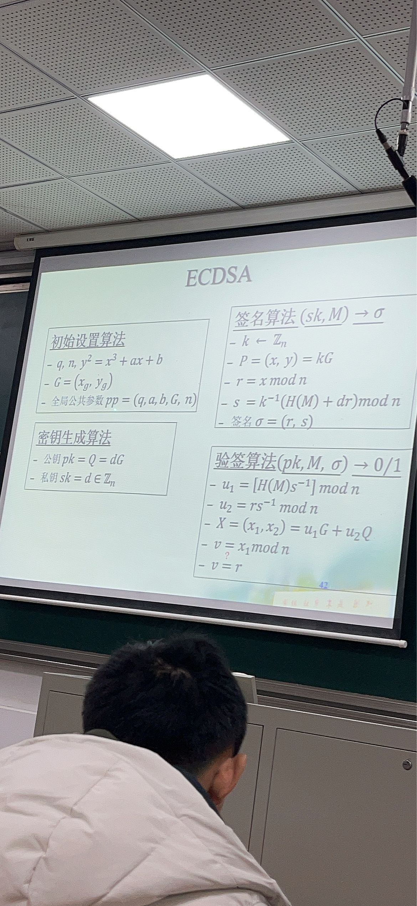
### RSA-PSS
RSA-FDH仍然是一个确定性签名，而RSA-PSS是随机性的。


## 数字签名升级（前沿知识）
算法不要求掌握，但可以了解一些知识。
### 一些变种
#### 签名者限制
##### Alice不能知道自己将要发送的信息是什么-盲签名
消费者消费时希望使用电子货币，而需要银行（权威机构）的签名，但不希望银行知道我消费了多少钱。可以将用户的消费请求信息盲化。
例如RSA中，发送Hash(m)时增加一个随机数的r^e，由于RSA的同态性，签名后可以直接乘以$r^{-1}$还原。
##### Alice能控制验签过程，只有部分人能验签-不可否认签名
没有签名者的帮助无法验签，且签名者无法否认一个有效签名。
例如A发布的软件包卖给B，A帮助B验签。
B又将软件包卖给C，而C没有A的帮助无法验签。除非B重新用自己的签名，但这样就会损害B的名誉。
###### 验签方式
有签名算法、验签协议、否认协议。
A可以否认签名，拒绝参与签名。而一旦参与了，就可以使用否认协议进行验证真伪。
签名者还可以委托某方作为验证者。
$Verify(A_input,B_input)$
###### 变色龙签名
先Hash再sign，但使用变色龙Hash，只要找到了陷门就能找到Hash的碰撞。
若知道陷门，就可以找到Hash(m,r)=Hash(m',r')。
- 有不可转移性：所有人都有Pk，所有人都能相互传播并验签，具有转移性。而如果发布签名者A直接将陷门发送给验证者(用户)B，那么B一定能构造出一个虚假的签名m',r'，则没有人(其他用户C)会相信B发送给他们的软件，只有A签名者本人发送的才行。
##### 让一个不知道私钥的第三方来帮助我签名-代理签名
- 要求：
  1. 代理人签名和本人签名一致
  2. 只有本人和代理人可以签名
  3. 知道是代理人签名还是本人签名
#### 验证者限制
##### Bob不能独立验证签名有效性-门限验证签名
需要其他**验证者**才能进行签名。
只有集齐n个人才能验证签名...
##### Bob不知道是Alice签的名-签名者身份隐私
仅知道这个签名者是一个组的成员，但不知道是谁。存在匿名性。
###### 群签名
只有群成员能以群名义发布签名。无论是谁都不能伪造签名。
一旦出现争端，群管理员可以追踪到是谁签的名。
###### 环签名
完全匿名，不会被管理员揪出来。多个人形成一个环进行签名，没有预先建立过程，无组织者，无中心。
##### 属性签名
公钥pk是一个属性，有一个函数f(pk)，仅当f(pk) = 1时，签名者才能签名。
##### Bob能对ALice签名的消息进行处理
###### 同态签名
允许在一定程度上的修改
###### 净化签名
签名m"允许贷款X万元"，且本签名仅在X<50时生效。
# 密钥管理
## 对称密钥分配基本方法
1. 对称密钥用于传统密码体制的密钥分配
2. 公钥体制用于传统密码体制的密钥分配:存在机构：证书体系CA。
### 演进
1. A和B通过物理手段交换
2. 选择第三方服务器S，S生成密钥发送给AB。服务器的密钥使用物理方式发送。
3. 新密钥用旧密钥加密：使用加密长期密钥加密会话密钥进行分享。泄露加密密钥则破坏安全性。
4. 密钥分发中心：Key Distribute Centre。每个用户和KDC拥有一对对称主密钥（用2方法交换），KDC为两个用户AB生成共享密钥，使用AB的主密钥发送给AB。 
  - 只需要n对主密钥；而会话密钥仍然是$n(n-1)/2$
### 基于对称密钥的密钥管理体制
##### 无中心
用户之间交换，$n(n-1)/2$
##### 第三方密钥交换
减少密钥分发代价：将分布式结构转变为中心式结构
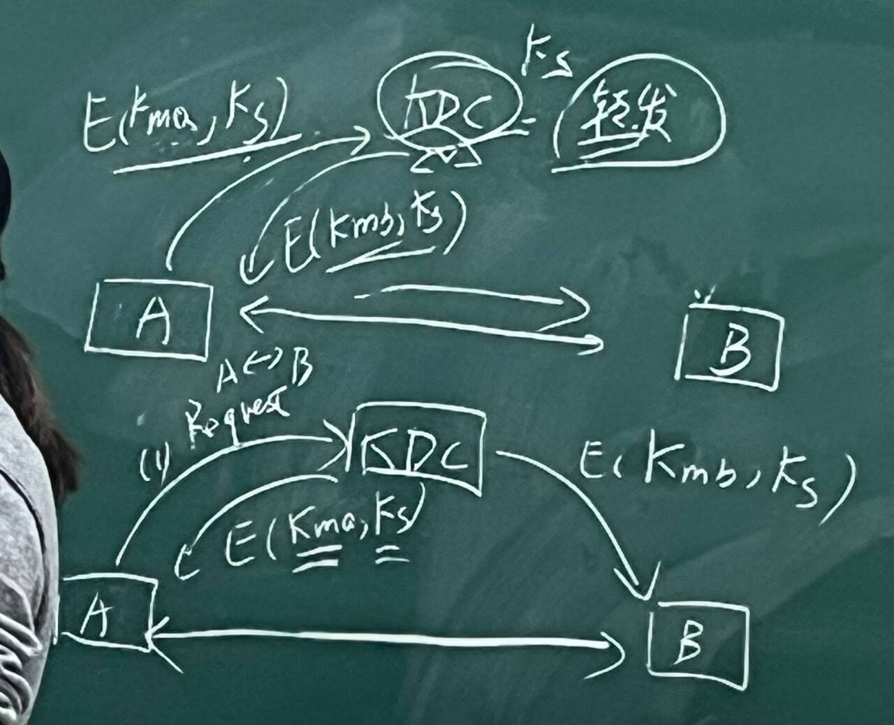

##### 密钥分层管理
降低分发开销、满足不同协议对层次结构密钥的要求。

### 基于公钥体制的密钥管理体制
由于对称密码效率更高，所以选择使用公钥体制来传递对称会话密钥，而用会话密钥加密通信。
#### Merkle方案
$A -> (KU_a || ID_a) -> B$。$KU_a$是A自己的公钥。
$B -> (E_{KU_a}(K_c) -> A)$。$K_c$是会话密钥。
存在中间人攻击。
#### NEED78方案
需要事先共享双方公钥。

$N_i$是某个随机数。
## 公钥分配基本方法
#### 自由方式
1. 通信时临时要求。无法进行身份认证。临时加密。
2. 扩散：将某人的公钥通过好友等进行转发，需要确保好友是可信的，例如PGP协议就是用了这个技术。
#### 公开目录
- 目录需要由可信实体(安全中心)来维护。
- 每个用户都在目录里存有{id,公钥}
- 面对面审核和注册
- 可以更新和废止
- 可以公开查询
给安全中心带来极大负担
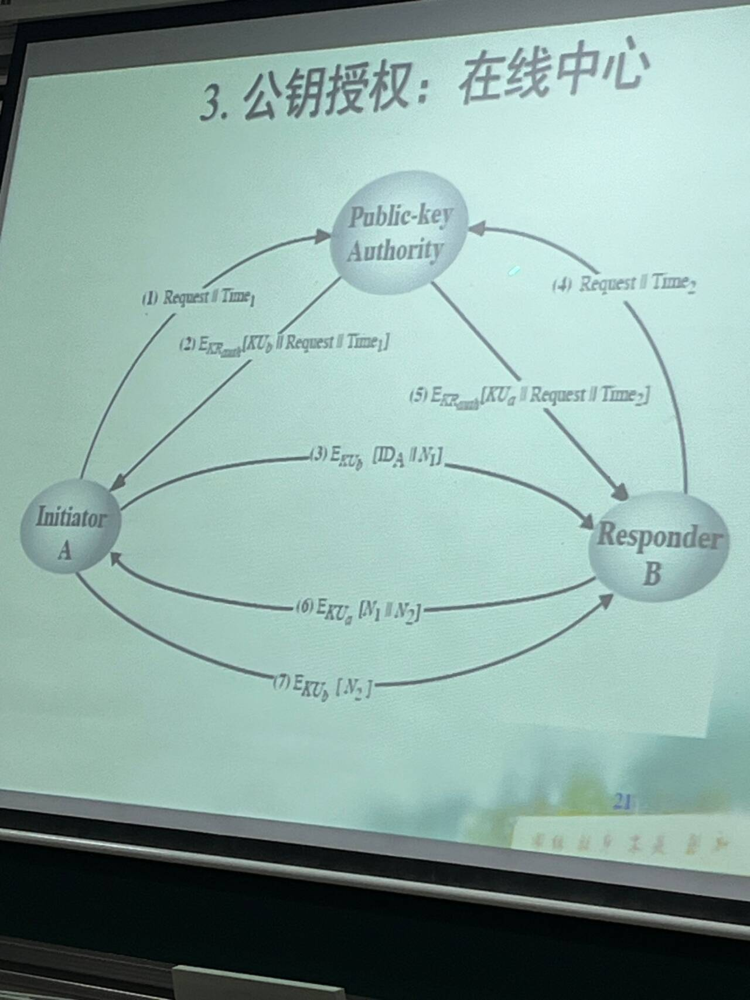
#### 离线中心：证书认证中心CA

##### X.509证书
是基于公钥密码体制和数字签名的标准
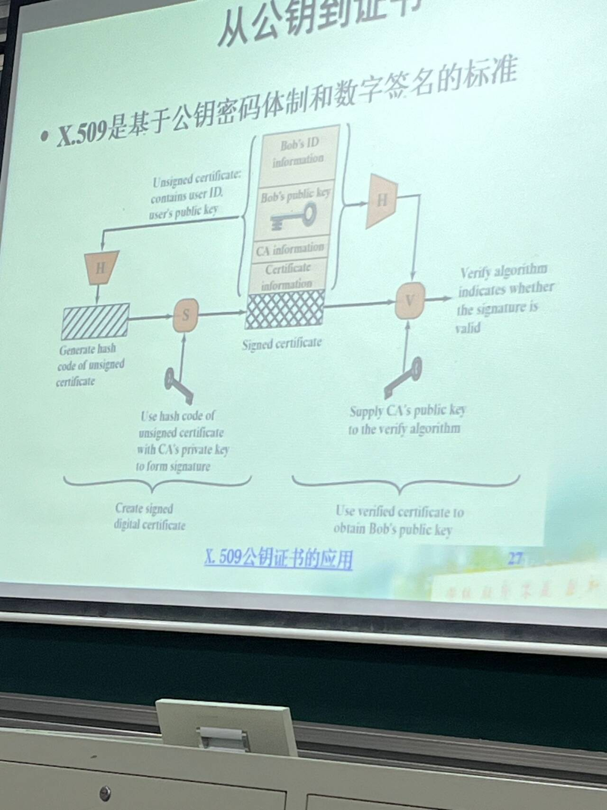
###### 证书格式
版本、序列号、算法标识和参数、签发者名字、持有者标识、生存周期等、扩展等。
##### CA
审核身份、签发证书。
###### 证书自证明和应用
1. 前提：有CA公钥。一般是自签名证书，可靠的获得，如手工获得或系统预置。
2. 证书公开不用保密，使用CA公钥来验证别人的证书中CA进行的签名，由于信任CA，所以信任此人。
3. 确认证书是可信且未被篡改。
###### CATree
不可能所有人都用一个CA,当有多个CA时,可以相互达成信任。通过节点连接达到全局可信。
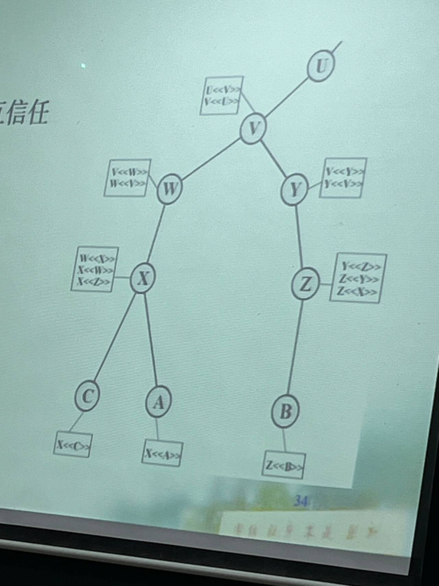
##### 证书撤销
如果证书被修改或身份改变、生存周期过等。
#### PKI：公钥基础设施
包括多个设施组织起来的基础设施，支撑整个公钥系统。
## 简单介绍几个东西
### 秘密共享
门限秘密共享：讲一个秘密S分成k份，给n个人，至少需要k个人一起才能获得秘密S。分散风险。
用的多的：Shamir的门限秘密共享。
### 轻量级密码
### 后量子密码

# 考试
问了一下她，密码学有选择判断大题，大题里面好像有填空，
大题几乎预订有手算RSA，
AES DES流程，
流密码原理，
一个哈希，
填空相关的，考了什么密码学基本思想，代换置换啥啥的，
两道古典密码相关的东西，一个是维吉尼亚（vigenere, 书p55出现），
另一个叫棋盘密码，我查了一下书上好像没有这个，有概率是记错了


